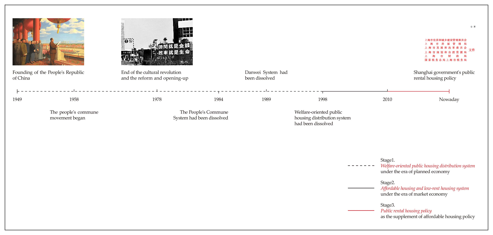
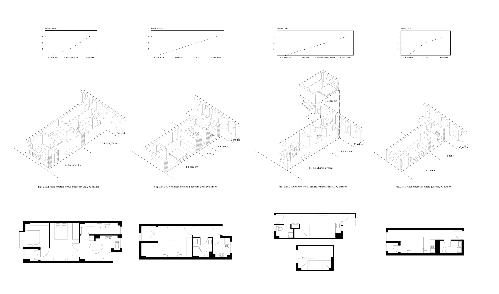
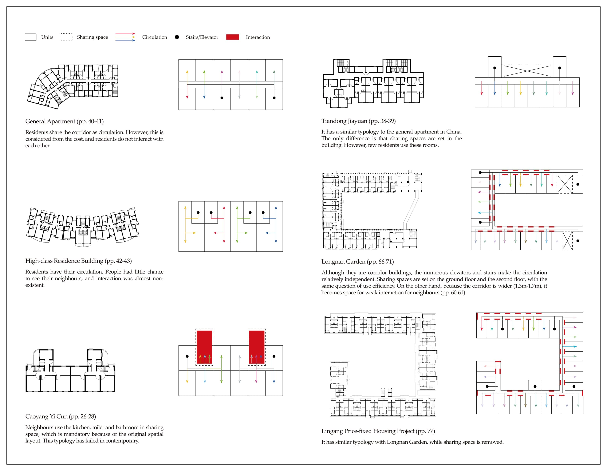
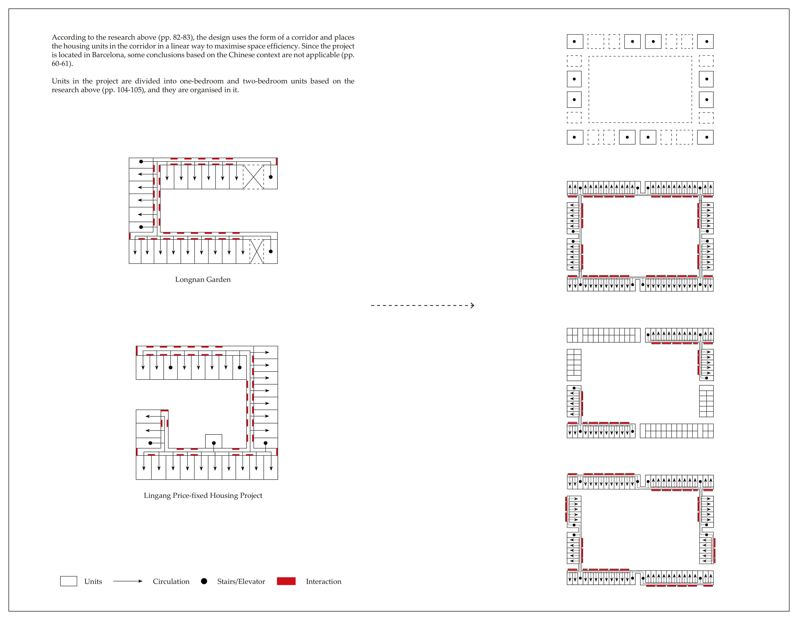

<special>
</special>

## The Middle Typology: Public Housing for the New Generation of China

This project records my postgraduate architecture study in AA Projective Cities - Studio 1: Parts, Units and Groups. In brief, it can be divided into four parts (steps), which explore the questions of contemporary collective living through typology as the core methodology. 

The complexity of the project make it difficult to define it as a "research" or "design". Due to the web format's limitations, the project's overall structure will be introduced here. For more details, please read the whole booklet on ISSUU: https://issuu.com/hanwenxu721/docs/_2016-2020

Fig. 1. The Minimum Dwelling of Teige Karel

In the first part (Chapter 1), according to a series of case studies, historical and contemporary. The author defines a preliminary research interest that would allow me to select other relevant examples of collective living. Several related analytical studies and comparative analyses of architectural precedents frame individual preliminary research interests, i.e., how the author would approach the design and research questions of collective living.

Fig. 2. The Study of Housing Policy in China since 1949 in Chapter 1

Then (Chapter 2), the chosen case studies will be described and analyzed through drawings. The analysis of building types and their formative diagrams requires the study of commonly shared traits by recognizing organizational and structural repetitions or exceptions that define their typicality in a formal sense and their socio-cultural meaning. The commonalities and transformations evident in a particular group of building types are compared as a series of descriptive and analytical diagrams that convey a building type's collective form, structure, organization, and construction.

Fig. 3. The Redraw of the Case Studies-Living Unit

Fig. 4. The Redraw of the Case Studies-Plan

In the third part (Chapter 3), the analyzed case studies, representing certain moments in the transformation of building types, should be contextualized by framing them within a comparative history. This history, a very brief survey made up of diagrams, photographs, drawings, and text, maps out the emergence and development of the chosen building type and should be part of the conclusions. Questions to be considered, for example, are the definition of generic room sizes and how the social diagram of housing and collective living change. Through the comparative history and matrices, an argument and assessment of the historical transformations of building types can be attempted, providing the grounds for a preliminary projection of an anticipated or necessary (future) typological transformation. Altogether, the aim is to understand typology less as a classification of building types, or for that matter, as contained by building types themselves, but to seek typological diagrams that transcend classificatory restraints.

Fig. 5. Comparative Analysis of Case Studies

Fig. 6. Unit, Floor, Community, Society and Functional Space

A quick design exercise will be proposed in the final part (Chapter 4), based on the studied type, the identified formative diagrams, and typological transformations. Learning from the case studies, the author will select a target site in a very different context and formulate relevant research questions, to address a project for a (new) form of collective living for specific subjects. The synthesis of historical analyses, their embedded social and familial relations, modes of production, and forms of association with the specific sociopolitical context of the chosen site, will generate a frame of relations. This organizational diagram would eventually be developed into a series of projective drawings, models, writings, and moving images.

Fig. 7. Forms: Study and Design

Fig. 8. The Ground Floor Plan

Fig. 9. Living Units

Fig. 10. The Axonometric

Fig. 11. Section 1-1`

Conclusion: 
Atomized Individual and the Architecture as Machine

Unlike their parents, Chinese youth who did not experience the collective living of the planned economy show individualistic tendencies after leaving university in the 2000s. At the stage of transformation from students in university to humans in society, they are separated from the original collective. The youths are in the process of joining a new collective (this collective may be their company, family, and friends, rather than the collective of the temporary social housing), making them more similar to atomized individuals. Therefore, the public activities in such social housing are restrained and moderate in design.

On the other hand, this typology of social housing was conceived as a temporary dwelling from the beginning of design. In the case of Longnan Garden, the designer even considered the possibility of converting social housing into other types of buildings after 20 years.

Thus, social housing is considered by designers, managers and residents as a transient living machine designed to help the residents through a crisis state in their life (i.e. the transition from student to social person). In Michelle Foucault's Of Other Spaces, social housing can be regarded as a crisis heterotopia. This machine (the housing project) aims to build bonds between these youths and society rather than collective bonds within the transient collective.

Bibliography:
Chen Yang, From Model Community to Monumental Site: a Workers’ Village through History. (Shanghai: Tongji University Press, 2019).
Clarence Perry, The Neighborhood Unit, a Scheme for Arrangement for the Family-Life Community. (1929).
Dieter Hassenpflug, the Urban Code of China, trans. Mark Kammerbauer (Basel: Birkhäuser GmbH, 2010).
Evans Robin, Translations from drawing to building and other essays,(Architectural Assiociation,1978).
Foucault Michelle, Of Other Space, (1986).
Fulong Wu, Packaging a New Way of Urban Life: Gated Communities and Chinese New Urbanism. (Cardiff: Cardiff University Paper, 2006).
Jacoby Sam, Drawing Architecture and the Urban, (London, John Wiley ＆ Sons Ltd, 2016).
Teige Karel, The Minimum Dwelling, trans. Eric Dluhosch (The MIT Press, 2002).
Zao Zhang, Stories of Longnan Social Housing - a Public Rental Housing Project and Its Designer’s Manifesto and Daily Life, Architectural Journal ,5(2017), (China Academic Journal Electronic Publishing House, 2017).