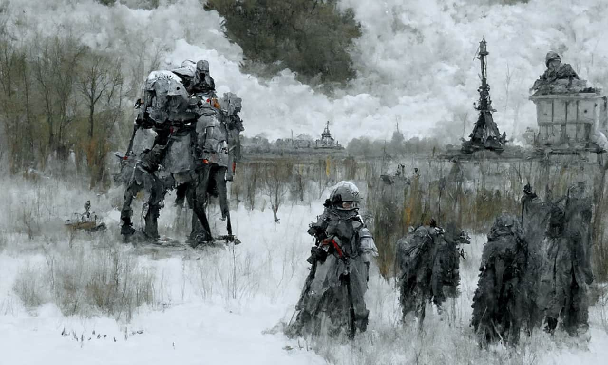
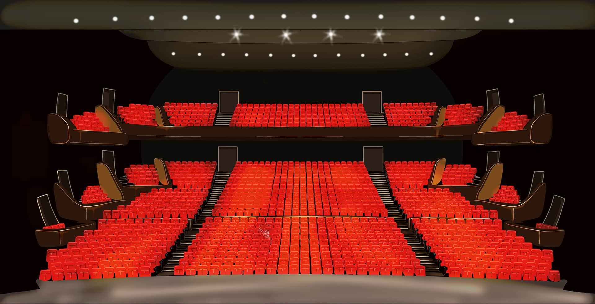

<special>
</special>

## Workers' New Village: the Spatial Sample of Urban in Planned Economy China

This project records my postgraduate architecture study in AA Projective Cities - Studio 2: Scales-From the Room to the City. In brief, it can be divided into four parts (steps), which explore the questions of contemporary collective living through typology as the core methodology. 

The complexity of the project make it difficult to define it as a "research" or "design". Due to the web format's limitations, the project's overall structure will be introduced here. For more details, please read the whole booklet on ISSUU: [Term2 Studio](https://github.com/HanwenXU721/HanwenXU.github.io/blob/master/resources/Term2%20Studio.pdf)

Consequently, Studio 2 builds on the previously introduced concept of formative diagrams about fundamental types as the basis to analyse models of collective living and forms of sharing, while the idea of type and typology is expanded to the study of the city. The city, in other words, is defined by typological conflicts and transformations that arise when types encounter a specific context and become materially realised. By uncovering these conflicts and transformations of the built form and the necessary scalar negotiations and translations, a specific idea of the city emerges with intrinsic formal, spatial, and social relationships.

The studio begins with selecting and analysing an existing or proposed urban plan for a contemporary city or region in which the building types chosen in Studio 1 play a significant and formative role. The aim is for the students to engage actively with a selected case study and to contact local authorities, collective architects, planners and researchers, formulating a 'live project'.

Following the primary analysis of the urban plan, the relationship of housing types to its conceptualisation, organisation, and formation is studied. How does the generality of type adapt to socio-cultural, economic, and political contexts? This study emphasises whether a typological transformation results from a typological conflict created by an insertion into a context, or a strategic argument and its possibilities within a context. This expands the conclusions of Studio 1 and requires a good knowledge of the urban plan's physical, social, and cultural context. 

In the end, a design exercise will be finished in a month. The design exercise explores cross-scalar relationships between the living units, urban compound (block), neighbourhood, and the city. Therefore, the two fundamental parameters to start with would be selecting a reference city and identifying a subject group, responding to which the formative diagram of the design exercise would be generated. The design would not only respond to the limitations and constraints but also informs a project, addressing inherent conflicts, power relations, social challenges, and environmental issues. The brief should be positioned within thoroughly researched historical and contemporary case studies.

For the inside of the larger auditorium, I drew an illustration of it. I was font of hand drawing at that time, therefore I did not choose to render this scene. I was satisfied with the output.