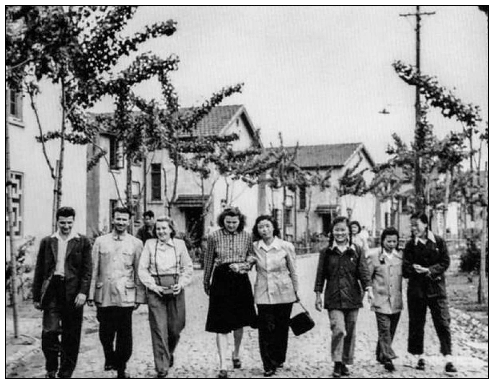
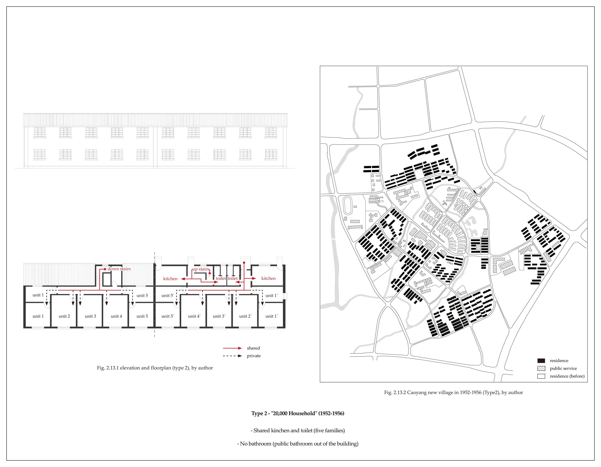
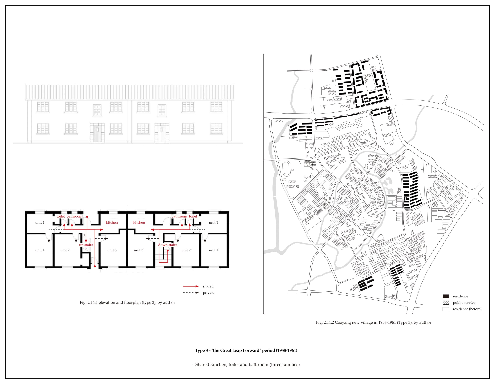
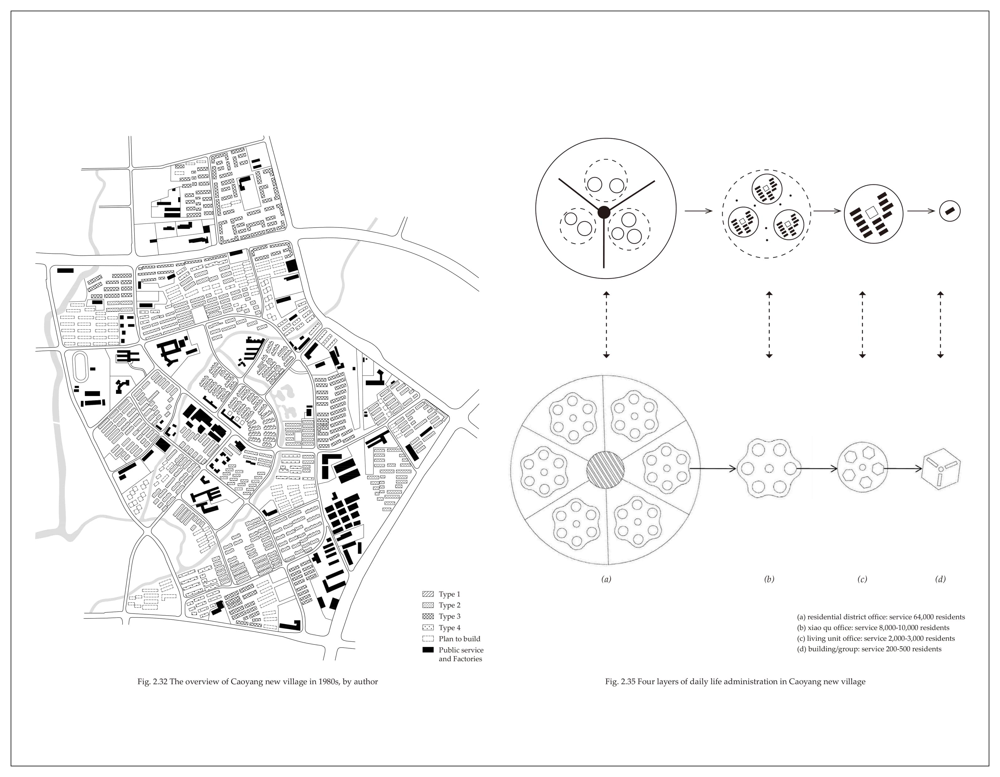
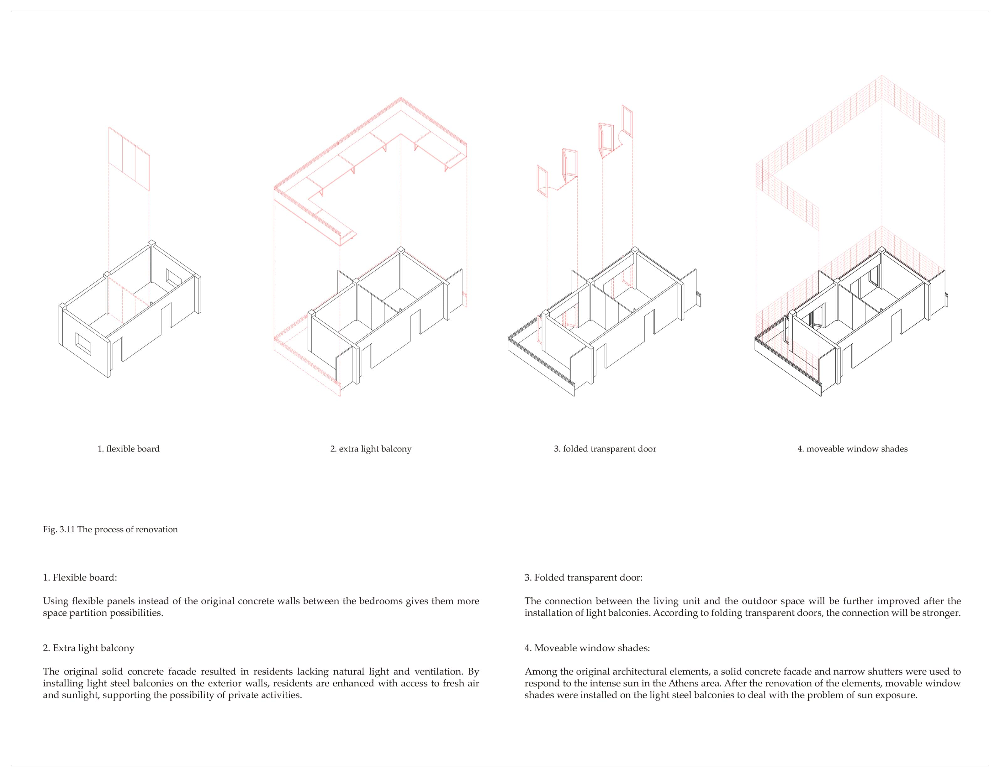
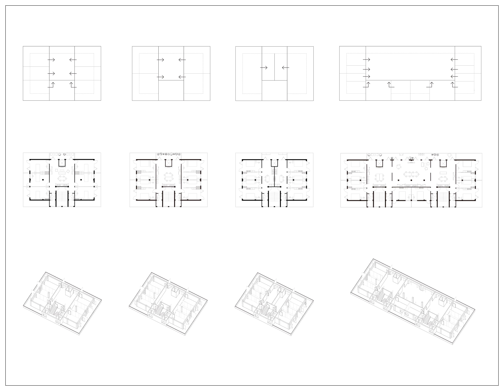
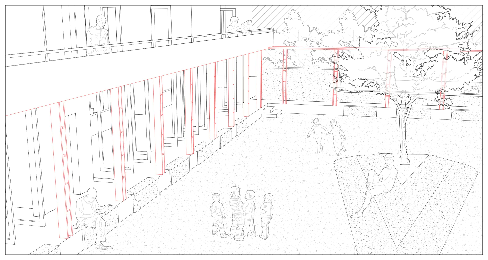

<special>
</special>

## Workers' New Village: the Spatial Sample of Urban in Planned Economy China

This project records my postgraduate architecture study in AA Projective Cities - Studio 2: Scales-From the Room to the City. You can download the whole project here: 

[Term2 Studio](https://github.com/HanwenXU721/HanwenXU.github.io/blob/master/resources/Term2%20Studio.pdf)
 
You could find more about AA Projective Cities at: 

http://projectivecities.aaschool.ac.uk/

INTRODUCTION

Workers' New Villages are collective housing built by the government to solve the living problem of the working class in planned economic China from 1949 to the 1980s. The meaning of the workers' new village lies in solving the housing problems of the working class as the backbone of the People's Republic of China, significantly improving the living conditions of the lower working people. Workers' village was one of the most important residential types in China. Take Shanghai for example. From 1952 to 1995, 442 workers' villages were built, with a total floor area of 34.97 million square meters. As a typology of a particular era, the workers' new village combines the ideology and planning theory of the era, the typology of workers' new villages aims to establish a "new age" ethic and ideal housing model in the turbulent second half of the 20th century in China.

"all history is contemporary history". The study of workers' new villages is the study of collective living in the era of the planned economy in China, and also the study of contemporary Chinese cities from planned economy to market economy. Although the construction of the workers' new village was stopped with the reform and opening up in the late 1990s, the planning theory behind it still deeply influences the urban living froms in China today. In this context, the change of workers' new village has become a projection of the change of urban living forms in China.

FIG.1. The "New Village" in the History

FIG.2. The Soviet Union Delegation Visits Caoyang New Village, 1950s

FIG.3. The Planning Structure of Caoyang New Village, by author

FIG.4.1. Caoyang New Village in 1952-1960 (Type1), by author

FIG.4.2. Caoyang New Village in 1952-1956 (Type2), by author

FIG.4.3. Caoyang New Village in 1958-1961 (Type 3), by author

FIG.4.4. Caoyang New Village in 1965-1970 (Type 4), by author

FIG.5. The Children were Having the Collective Living in the School as Rehearsal

FIG.6.  Four Layers of Daily Life Administration in Caoyang New Village

FIG.7. Collective Living Design: the Scale of Architectural Elements

FIG.8. Collective Living Design: the Scale of Living Unit

FIG.9. Living Units: Type and Scale

FIG.10. Collective Living Design: the Scale of Urban Block

FIG.11. The Public Space is Hidden from Outside the Community

FIG.12. The Space as Centralized Public Space for the Community

CENTRALIZED FORM AND THE REBUILD OF COLLECTIVE

Workers' new village is the main body of urban housing construction from the 1950s to 1990s in China, and also the utopian collectivist living form established in the age of scarcity. The word "workers' new village" is not only the spatial sample in the era of planned economy China but also an important tool to construct the identity of workers (and most of the Chinese) through collective living. In addition, the workers' new village practice also directly led to the birth of the modern Chinese public housing system and the establishment of China's grass-roots social management system. These systems are still profoundly affecting the contemporary urban context in China.
  
In the case of Caoyang new village, it can be clearly found that different levels of spatial sharing establish the centralized collective life, allowing residents to bond the special relationship with neighbours or co-workers. 

The design exercise uses a similar strategy in Kaisariani, Athens. According to the reorganization of three levels, architectural elements, living units and urban blocks, a flexible and centralized form of living is constructed. This collective living fits Kaisariani's history and urban context and rebuilds the collective in this unique region.

BIBLIOGRAPHY

Chen, Deyang. Maocheng Zhu and Christian Labor Village Movement (1920-1937). 2020.

Din, Guijie, The New Estate for Workers: "Happy Life For Ever". doctor thesis, Tongji University.

Guo, Shenli. the Establishment and Reform of Residents Committee: A Case Study of Shanghai. China Society Press, 2006.

Henriot, Christian. Shanghai 1927-1937: Municipal Power, Locality, and Modernize, trans. Peide Zhang. Shanghai: Shanghai Classics Publishing House, 2004.

Howard, Ebenezer. Garden Cities of To-morrow. 1898.

Lefebvre, Henri, Espace et Politique, trans. Chun Li. Shanghai: Shanghai People's Publishing House, 2015.

Li, Yingchun, “New Village”: an Alternative Scope for the Study of Built Environmen. Time Architecture, 2(2017).

Liang, Zhiyong. From Village for Commoners to Workers' New Village: the Continual Civilizing Mission of Shanghai's Public Housing, 1927-1951. Time Architecture, 2(2017).

Mao, Zedong. The Work of Student (Translated from Chinese: 学生之工作). 1919.

Perry, Clarence. The Neighborhood Unit, a Scheme for Arrangement for the Family-Life Community. 1929.

Shanghai Housing Construction Records. Shanghai: Shanghai Academy of Social Science Press, 1999.

Shanghai Residence (1949-1990). Shanghai: Shanghai Science Popularization Press, 1993.

Wang, Dingzeng. Planning and Design of Shanghai Caoyang New Village Residential Area. 1956.

Wang, Hua and Qingsheng Chen, Discussion on several problems in residential planning and design of Shanghai. Architecture Journal, 2(1964).

Wu, Zhongxin and Liuxiu Geng, Some methods of public building planning in Shanghai residential area, Architecture Journal. 1981.

Xiang, Xuan. The Research of Workers Community Residential Architecture and Outdoor Environment in Jiangsu, Zhejiang and Shanghai from 1949 to 1978 - Research Based on Spatial form and Form Characteristics.  2011.

Xu, Xiaofeng. Urban Spatial Change From the Perspective of New-Marxism: a Case Study of Workers' Village in Shanghai. Urban Planning Forum, 7(2019).

Xue, Fengxuan. A History Review on Theories Related to the Development and Change of Chinese Cities, Acta Geographica Sinica. 11(2002).

Yang, Chen. From Model Community to Monumental Site: a Workers’ Village through History. Shanghai: Tongji University Press, 2019.