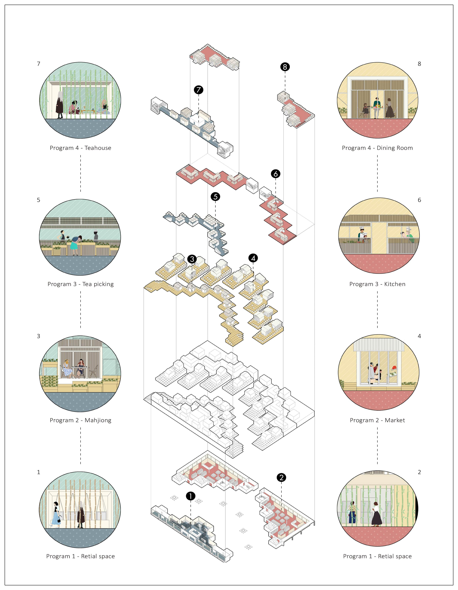
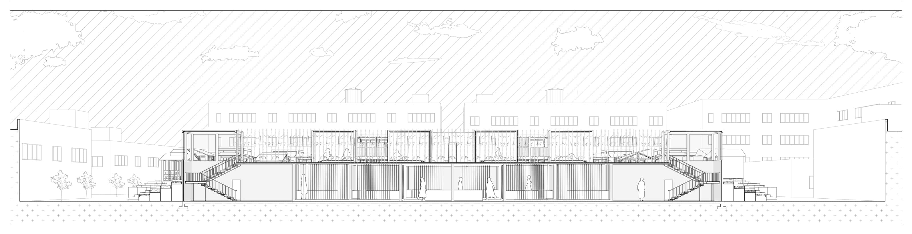
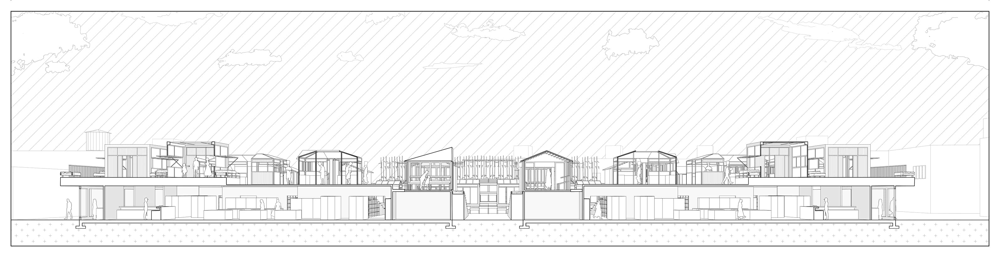

<special>
</special>

## Project Terrace

2018 Spring Semester, Year 3 

Community Commercial Building

Individual Work

 

This project records undergraduate architecture study of Hanwen XU in 2018 Spring Semester, Year 3. 

Download the whole project: 
[Bachelor Work Collection 2016-2020](https://github.com/HanwenXU721/HanwenXU.github.io/raw/master/resources/Term1%20Studio.pdf)

 

 FIG.1. "Real Local Experience": Zhaduzha Weekend Market, Bangkok

"Project Terrace" continues the discussion of immigration from the project Folding Longchang. Even if the migrants go all out to settle in the city, more problems will be waiting for them. It can be seen that, for whatever reason, communities made up of immigrants are often considered "off-limits" in large cities. Even if these immigrant areas are not a high crime and dangerous, they at least represent the most heterogeneous parts of the city. Then there is the problem of implicit segregation within cities.

In this project, a Sichuan immigrant community in Shanghai is chosen as an example. According to pick "slow life", a crucial life concept in Sichuan culture, as a critical element, there special programs (teahouse, hot pot, and mahjong) are organized in the building. When the facilities are used by Sichuan residents nearby, they also become the blueprint and landscape for visitors from "outside". Through this mix of outside visitors and local Sichuanese, the author tries to achieve an authentic and profound experience like the Zhaduzha Weekend market in Bangkok.

 FIG.2. The Three Most Important Cultural Images in Sichuan Culture

In design, typology is used as the central methodology. I referred to the architecture and cultural fragments in Sichuan. Based on people's memory of Sichuan culture, I extracted simplified type elements from it. The new type will have the same prototype as the type in human memory to achieve homology, and it also becomes a metaphor for visitors outside.

 FIG.3. Design Strategy: Type and Metaphor

 FIG.4. Function and Structure

 FIG.5. Sections of the Project

 FIG.6. Project Terrace: a Holographic Picture

