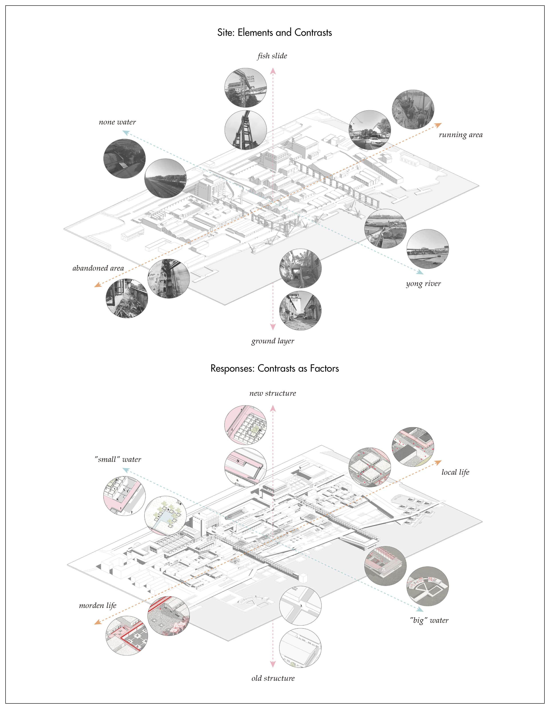
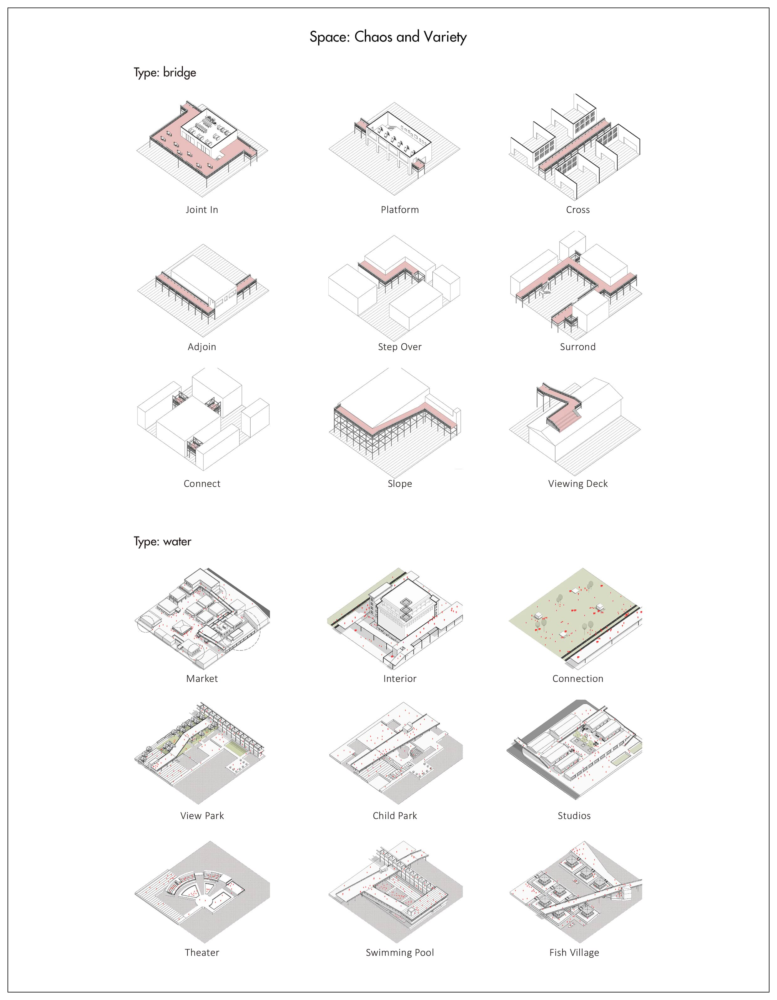
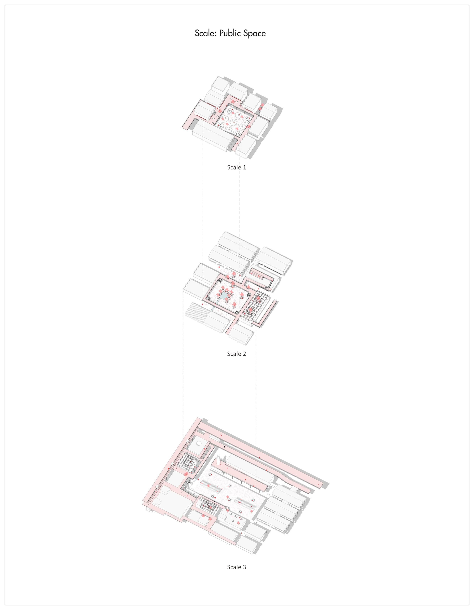
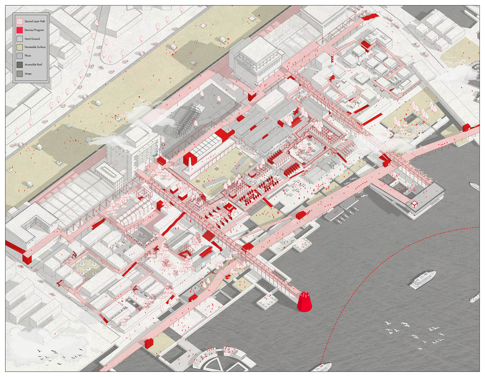
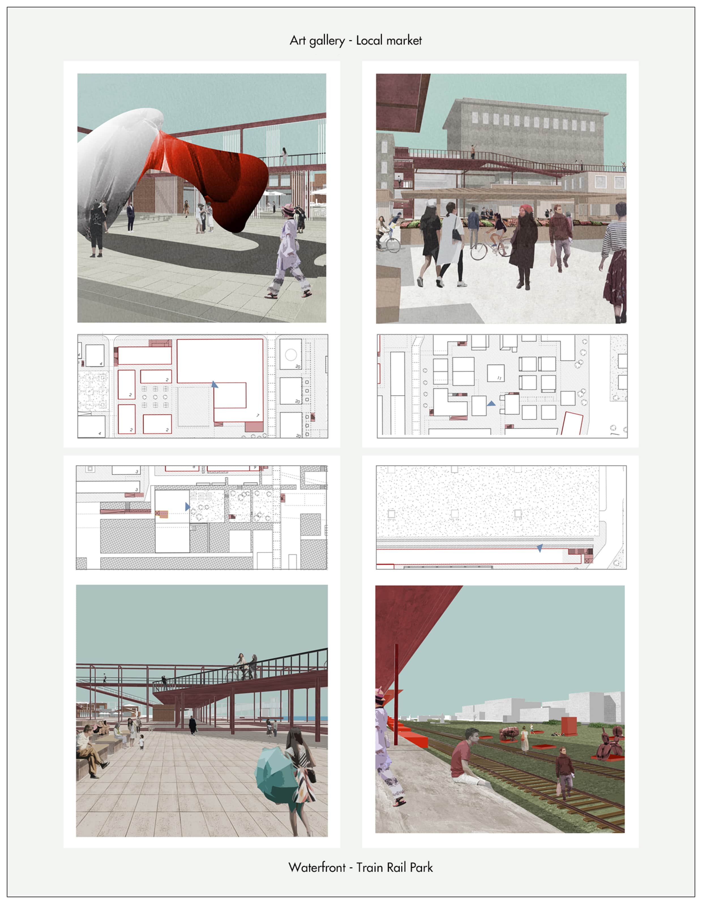

<special>
</special>

## Yuanyang Fish Factory Renovation

2019 Fall Semester, Year 4

Renovation of Industrial Zone

Group Work (Hanwen Xu, Yuhang Tao, Zhengyou Chen and Tiancheng Kang)

This project records undergraduate architecture study of Hanwen XU in 2019 Fall Semester, Year 4.

Download the whole project:

[Bachelor Work Collection 2016-2020](https://github.com/HanwenXU721/HanwenXU.github.io/raw/master/resources/Term1%20Studio.pdf)

 

Yuanyang fish factory is located at the riverside of the Yong river in Ningbo. As the symbol of the industrial era of Ningbo, now half of the site remains abandoned. The charming duality of dilapidation and operation allows us to bring back the history of the industrial age and the planned economy to the people in Ningbo, which also adapt to contemporary urban life. Two opposite programs (modern life/local life) are set based on the duality of the site (left-dilapidation/right-operation).

The context of the original factory supports us in the pathway for design. Following the four layers of the site, and elements such as the fish slide (the bridge), waterfronts and train rail, this project attempts to demonstrate the fascinating, typologically complex and chaotic nature of the Yuanyang fish factory.

 FIG.1. Typological Characteristics of the Site

 FIG.2. Contrasts as Design

 FIG.3. Contrast: Rethinking

 FIG.4. Design Strategy: Chaos and Variety

 FIG.5. Design Strategy: Scale of Public Space

 FIG.6. The Masterplan of the Project

 FIG.7. The Axonometric: Rebuild the Complexity and Chaos Characteristic

 FIG.8. The Tourist's View

