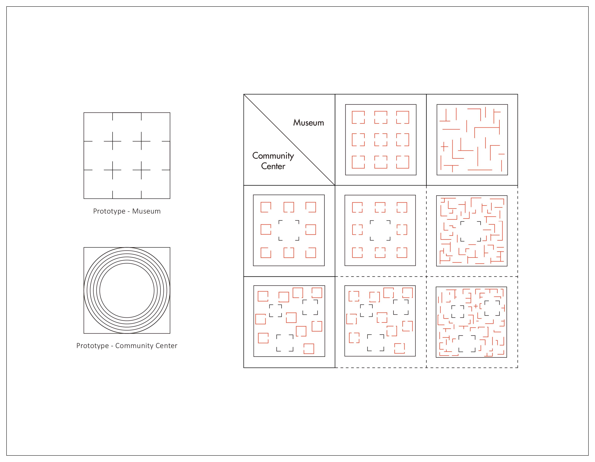
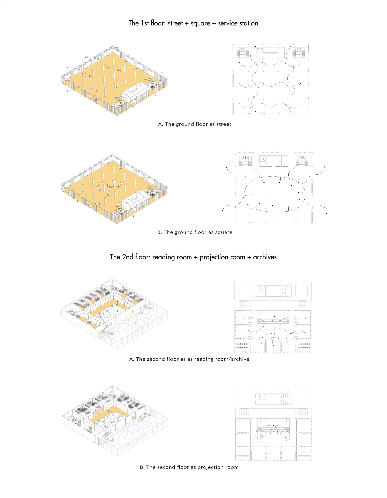
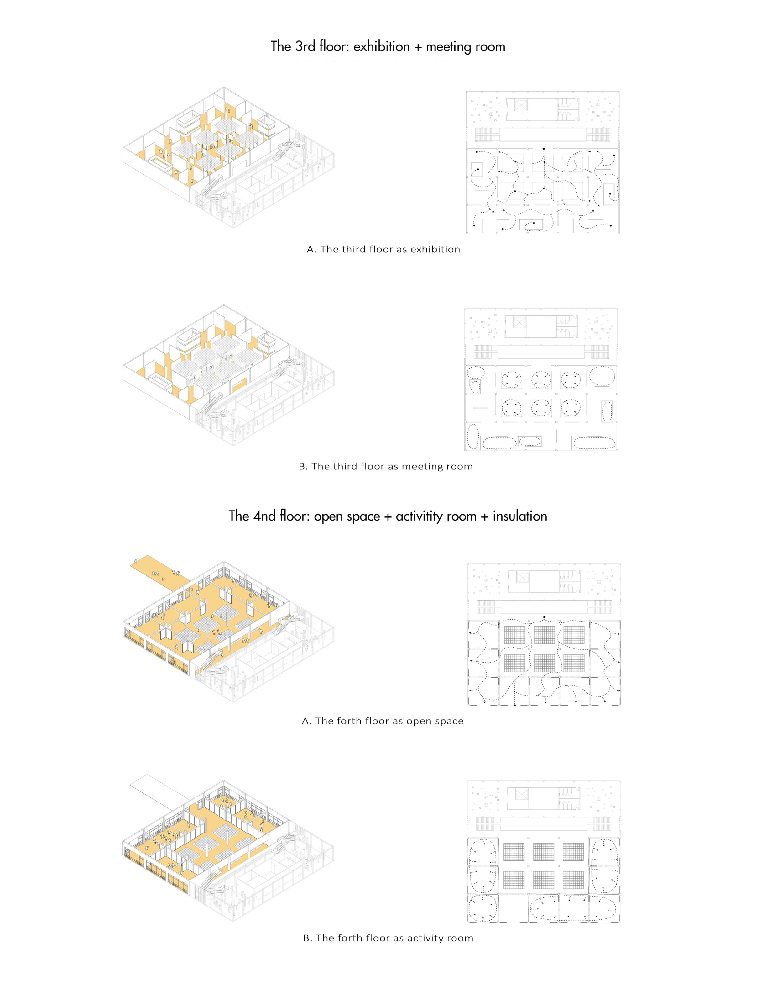
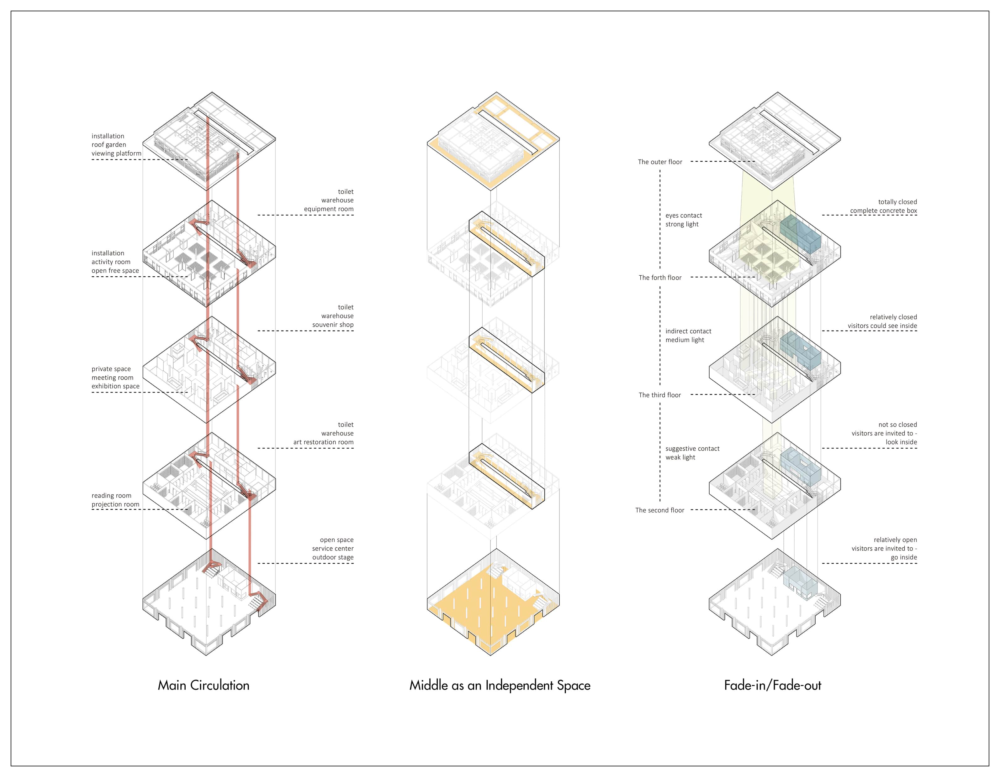
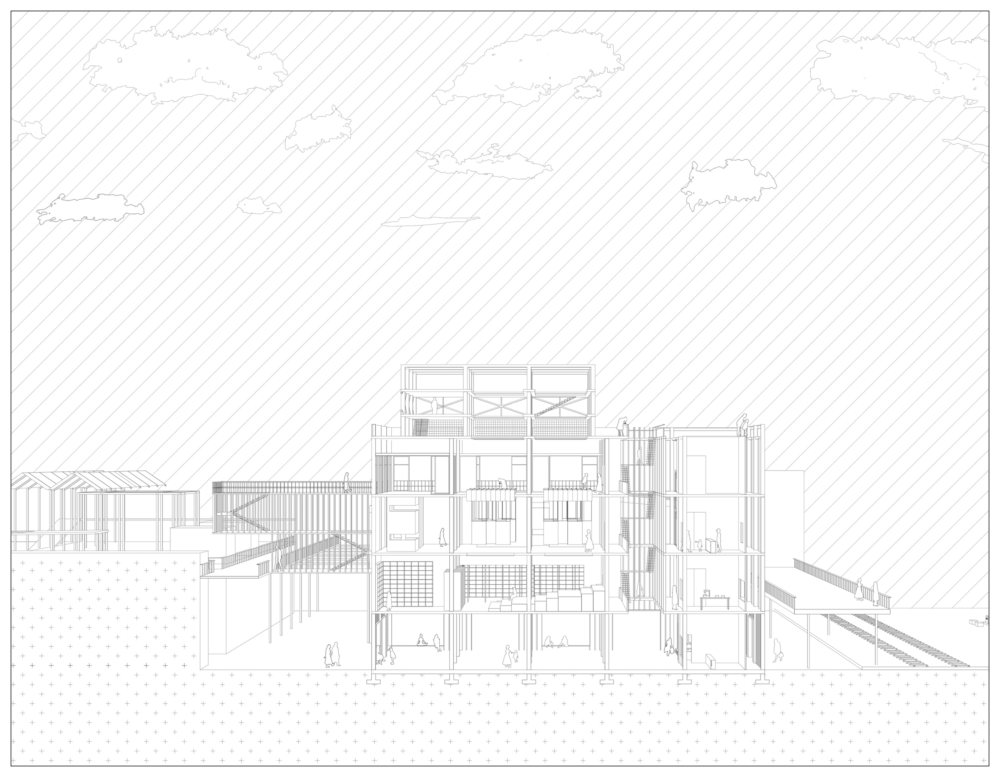
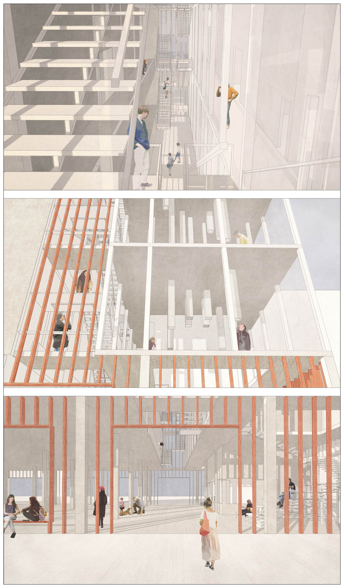

<special>
</special>

## The Moon and Sixpence

2020 Spring Semester, Year 4

Museum and Community Center

Individual Work

For more details: https://issuu.com/hanwenxu721/docs/_2016-2020

The project's name comes from the British novelist William Maugham's Moon and Sixpence, which celebrates the hero's action of Paul Gauguin in abandoning everyday life for the sake of great art. In comparison, this project tries to rethink the moral superiority of the two metaphors, the moon and sixpence. Based on the site in project "Yuanyang Fish Factory Renovation", an old fish factory was chosen for the design. Two pairs of opposing programs (museum-community centre) are organized base on the original structure. According to the hybrid of type and mix of space, a multifunctional architecture with new typology has been created.

Fig. 1. Site Re-analysis

Based on the site of "Yuanyang Fish Factory Renovation", the old ice factory is chosen as the site. Its essential location and function make it a natural centrepiece of the entire area. In addition, being a heritage of local industrial architecture allowed the designer to use the remaining architectural elements fully.

Fig. 2. Structure Re-analysis

Like the duality of the site shown in the previous project "Yuanyang Fish Factory Renovation", in this project, the author tries to rethink the complexity of the architectural space and the diversity of meaning in use.

While "Moon" and "Sixpence" become two metaphors, the designer tries to discuss that if space for idealism (non-daily) and pragmatism (daily) could exist one with each other.

Fig. 3. Two Metaphors: Non-dialy and Daily

The museum and the community centre are two spatial prototypes of the project. According to the hybrid of two types, a series of spaces come out which have the potential to satisfy both needs. By hybridizing the geometric prototype summarized in a case study series of "museum" and "community centre", new types conforming to the characteristics of the two (museum and community centre) can be obtained, thus achieving the homology of the types mentioned by Aldo Rossi.

Fig. 4. The Prototype and the Create of New Type

In addition to the hybridization of the dimension of space, time becomes another dimension discussed in the project. The hybrid of programs could be divided into two kinds in the time dimension, simultaneous and non-simultaneous.

Fig. 5. Time Becomes Another Element to Discuss in the Project

As a result, a series of programs are organized in the building base on such logic. Some of them show the multiplicity of space. At the same time, time is also a dimension that cannot be ignored in the hybrid of programs.

Fig. 6. The Programing of the Space

Fig. 7. The Factors in the Exist Ice Factory as Design Elements

Fig. 8. Section 1-1`

Fig. 9. The Axonometric: the Building as an Hub

—————————————————————————————————————————————————

