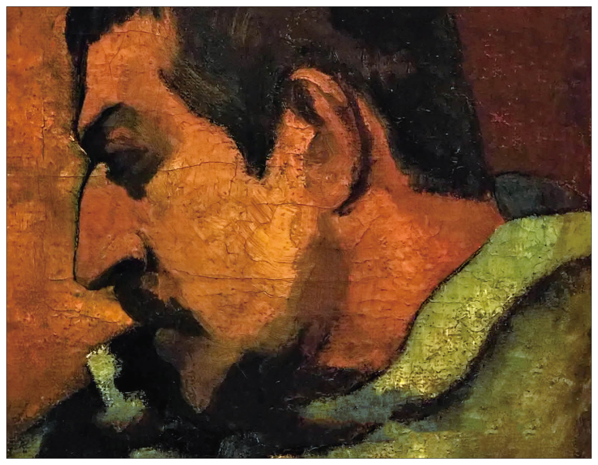
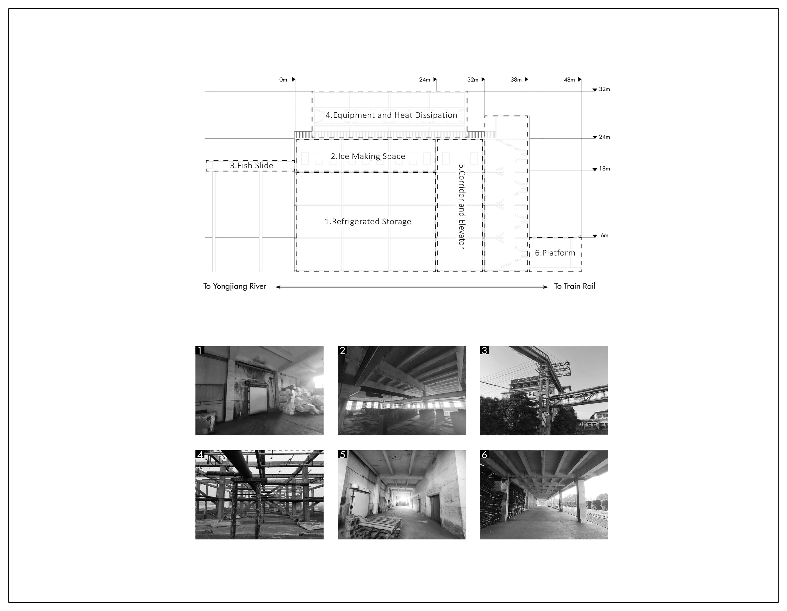
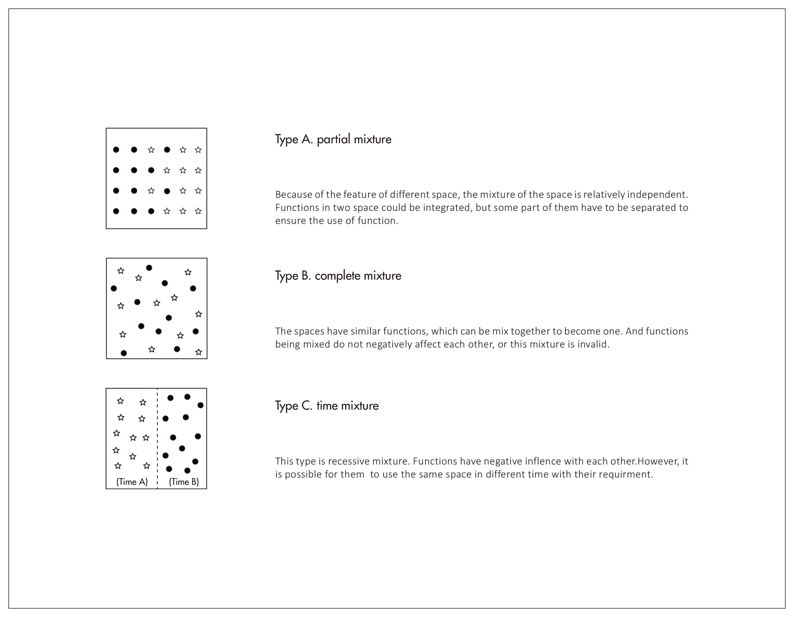

<special>
</special>

## The Moon and Sixpence

The project's name comes from the British novelist William Maugham's Moon and Sixpence, which celebrates the hero's action of Paul Gauguin in abandoning everyday life for the sake of great art. In comparison, this project tries to rethink the moral superiority of the two metaphors, the moon and sixpence. Based on the site in project "Yuanyang Fish Factory Renovation", an old fish factory was chosen for the design. Two pairs of opposing programs (museum-community centre) are organized base on the original structure. According to the hybrid of type and mix of space, a multifunctional architecture with new typology has been created.

Fig. 1. Site Re-analysis

Based on the site of "Yuanyang Fish Factory Renovation", the old ice factory is chosen as the site. Its essential location and function make it a natural centrepiece of the entire area. In addition, being a heritage of local industrial architecture allowed the designer to use the remaining architectural elements fully.

Fig. 2. Structure Re-analysis

Like the duality of the site shown in the previous project "Yuanyang Fish Factory Renovation", in this project, the author tries to rethink the complexity of the architectural space and the diversity of meaning in use.

While "Moon" and "Sixpence" become two metaphors, the designer tries to discuss that if space for idealism (non-daily) and pragmatism (daily) could exist one with each other.

Fig. 3. Two Metaphors: Non-dialy and Daily

Fig. 3. Two Metaphors: Non-dialy and Daily