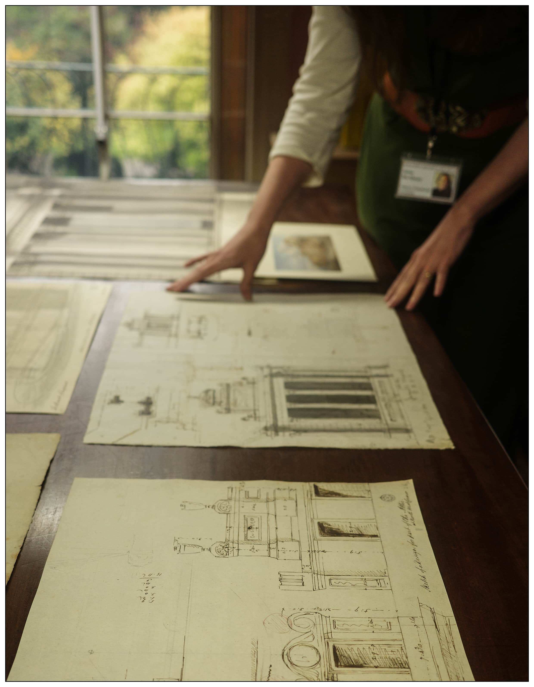
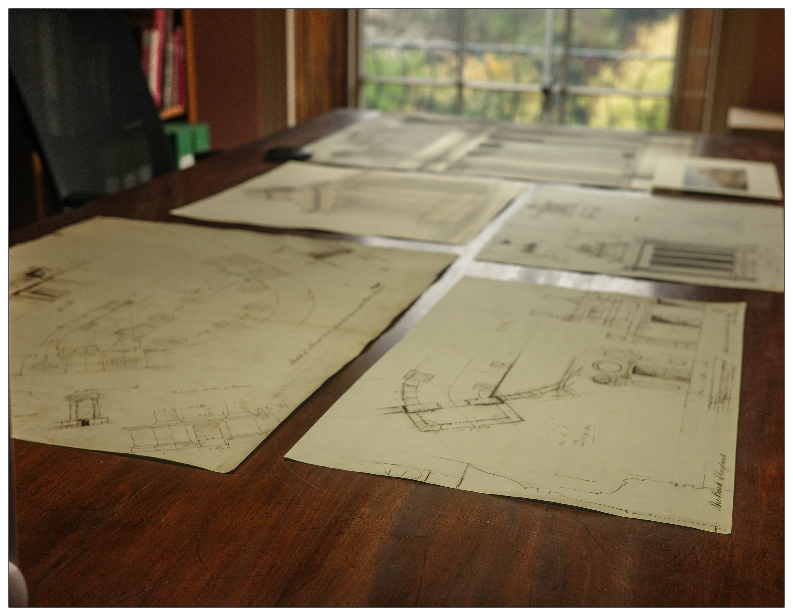
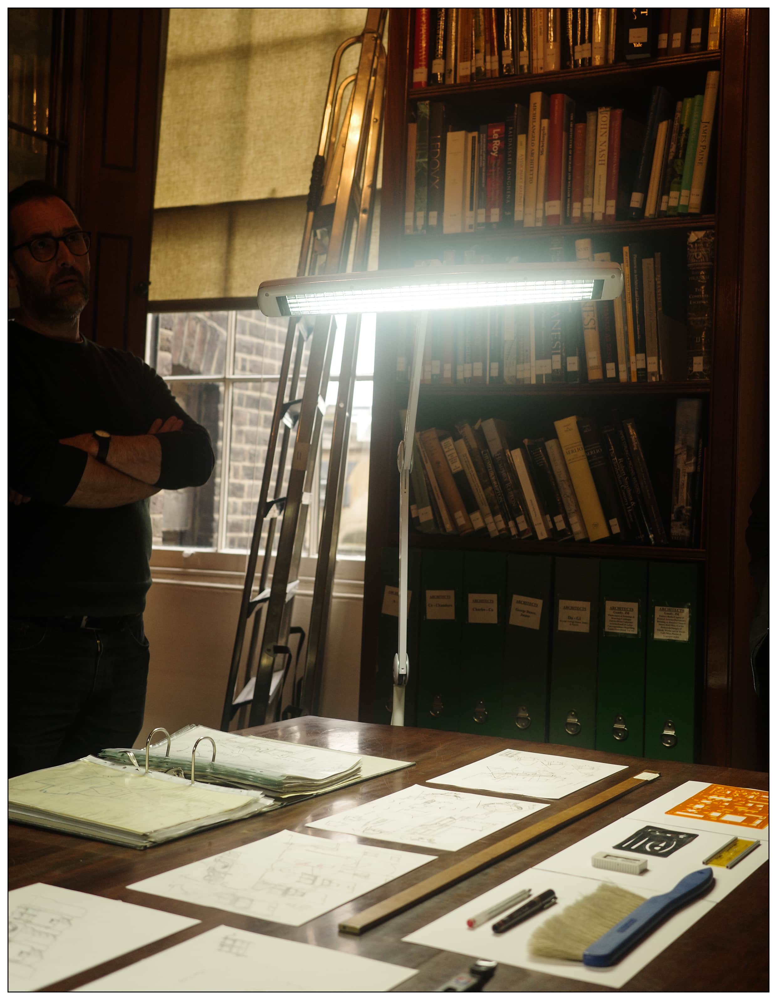
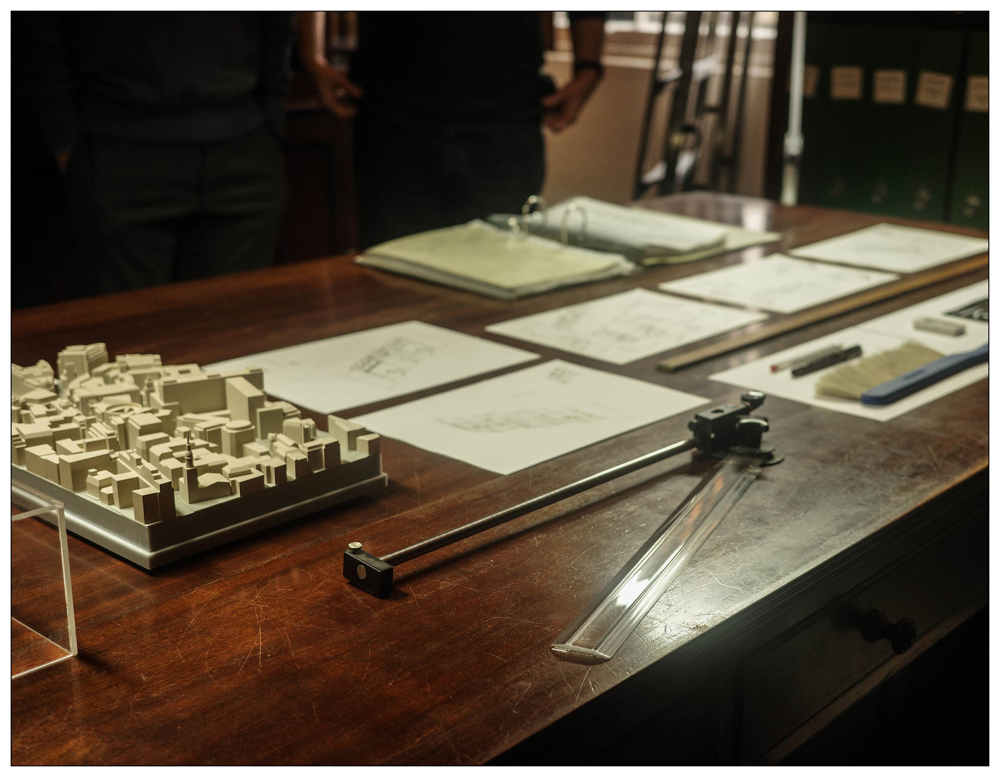
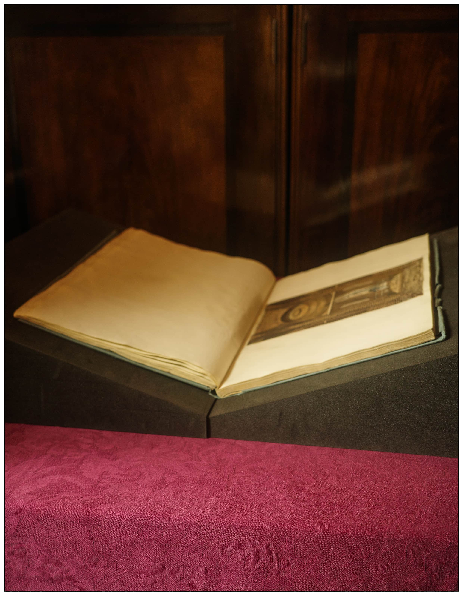
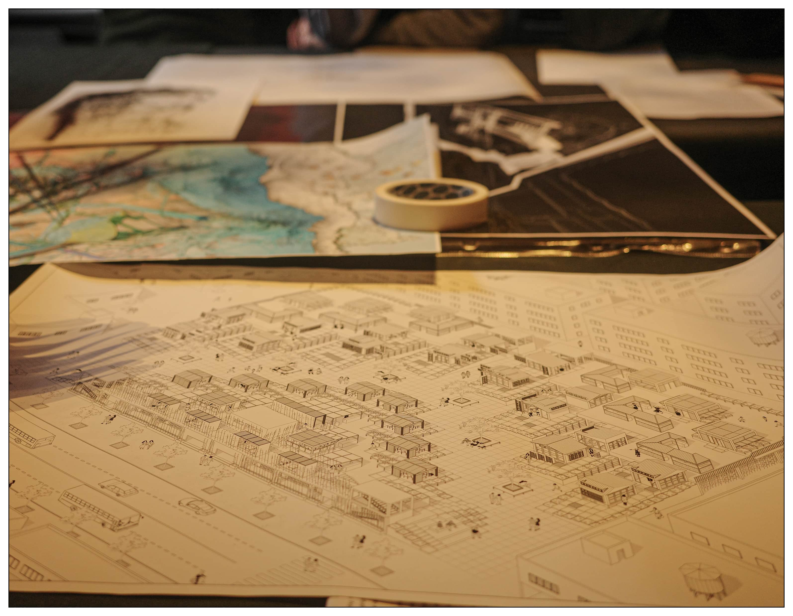

<special>
</special>

## Drawing Rooms: Soane, Stirling, Today

The workshop, Drawing Rooms: Soane, Stirling, Today, is hosted by Dr Marco Iuliano (University of Liverpool School of Architecture) at Sir John Soane’s Museum in London. In this workshop for architecture students, guests have the opportunity to view at close hand drawings produced by both Soane and Stirling’s offices in sessions led by Anna McAlaney, (Library Curatorial Assistant at Sir John Soane’s Museum) and Dr Marco Iuliano. There will also an exclusive visit to Soane’s newly restored Drawing Office and an exhibition tour of The Architecture Drawing Prize 2022, led by 2021 winner Dafni Filippa, to see the best in contemporary architectural drawing from around the world. The session includes a group discussion and an opportunity for participants to share examples of their own architectural drawings.

I join the workshop as student representative.

 

