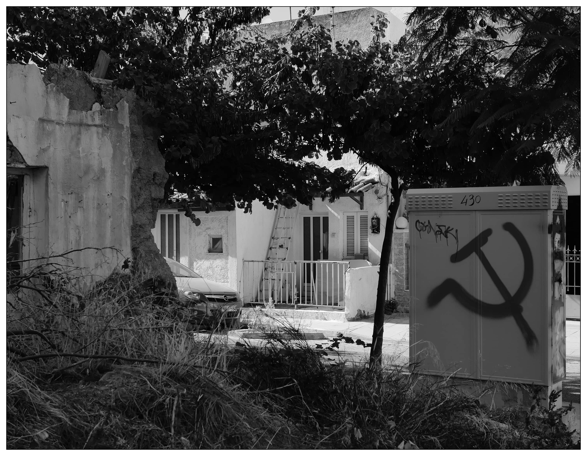
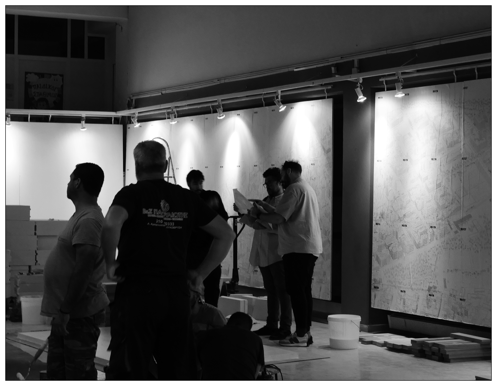
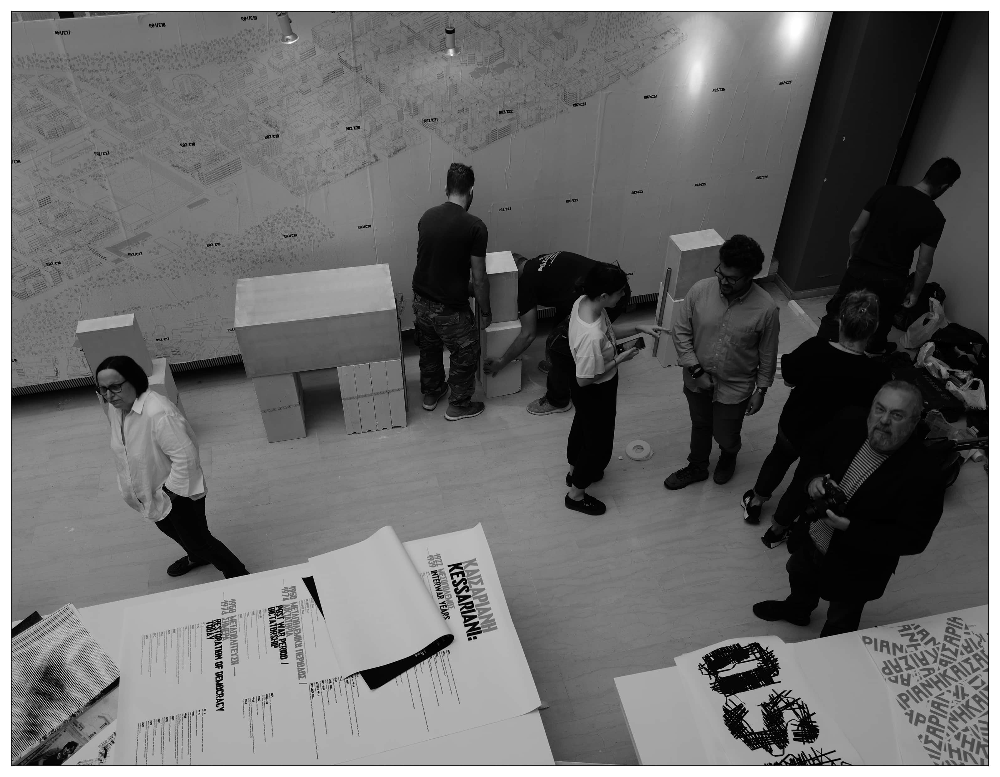
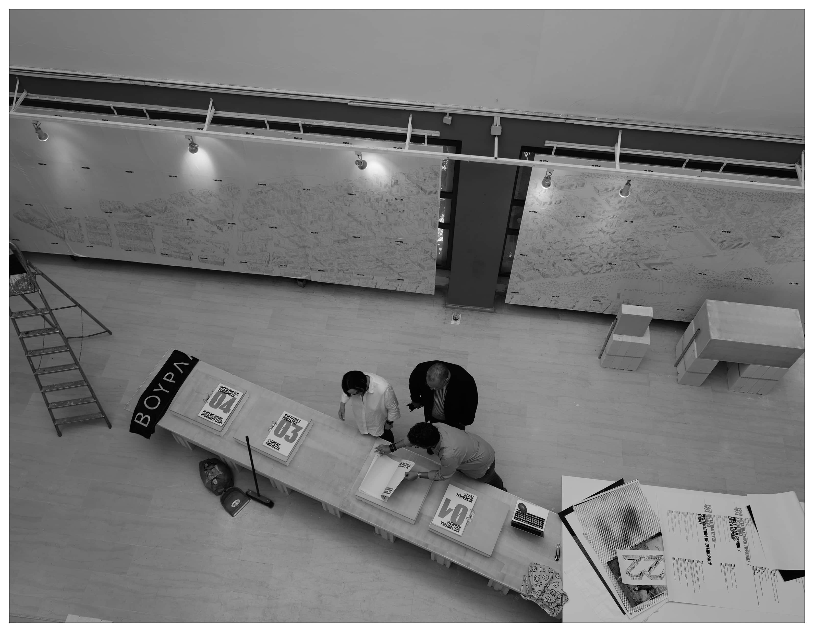
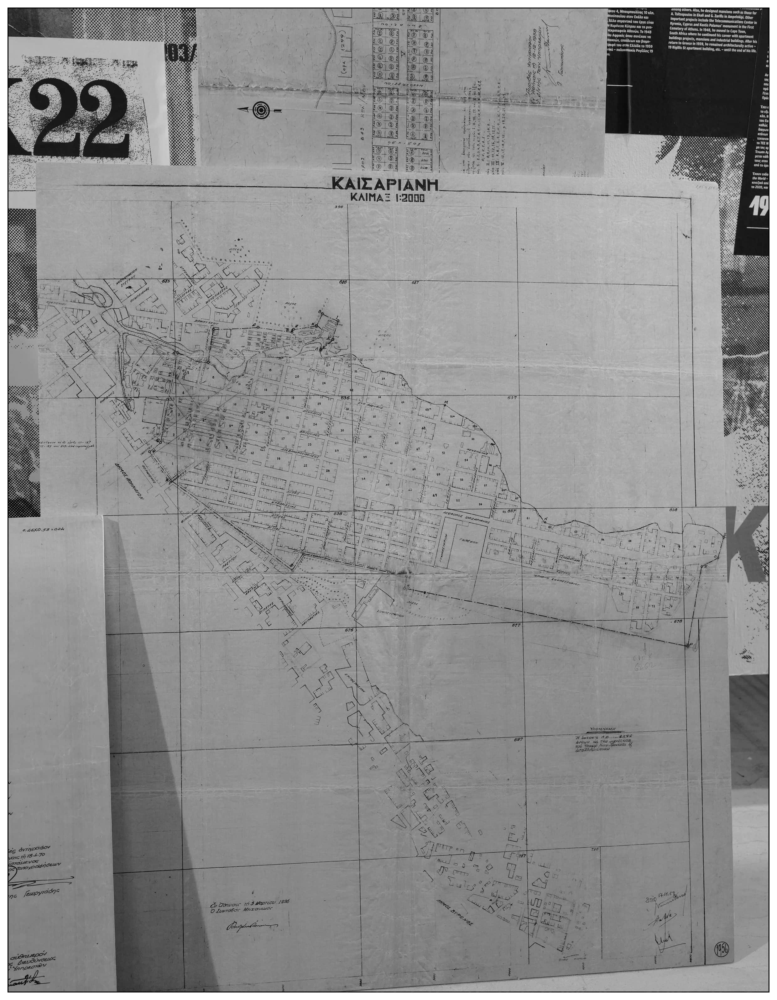
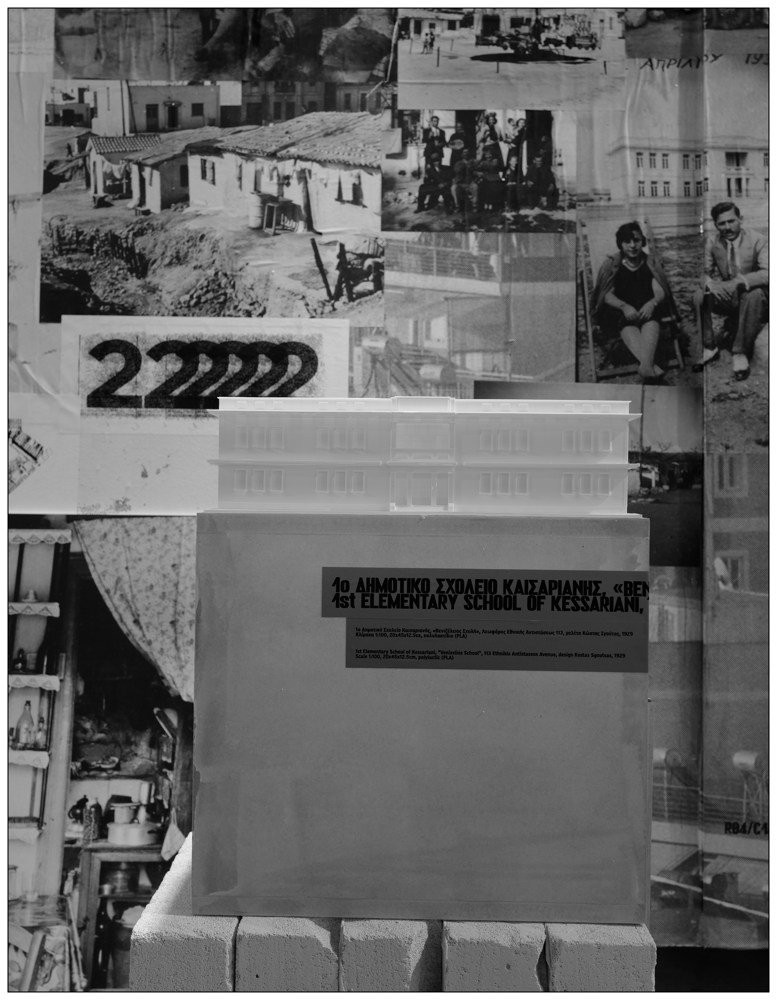
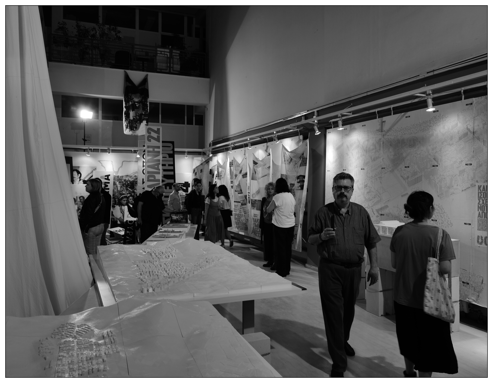
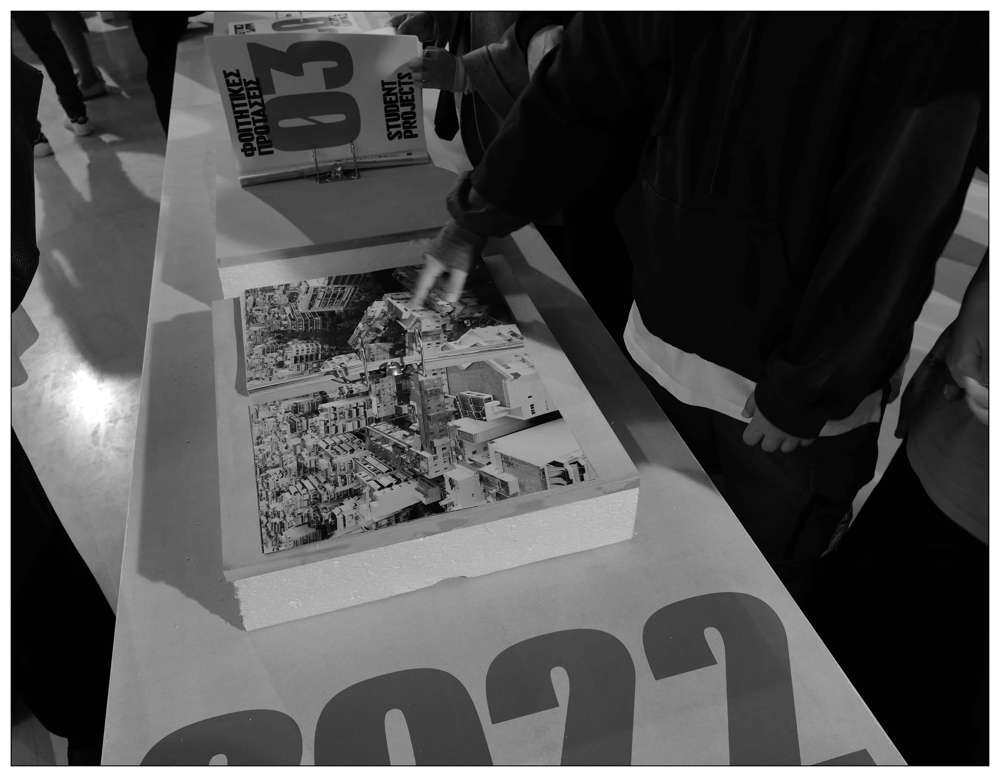
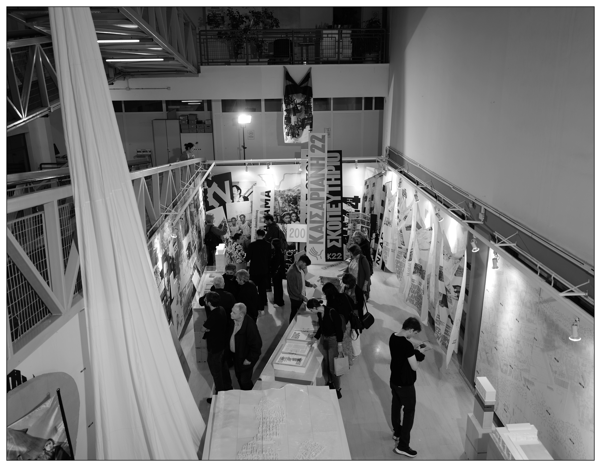

<special>
</special>

## Kassariani22

Kessariani 22: Histories and Projects aims to develop new housing typologies, innovative models of refurbishment and restoration, and highlight the historical urban fabric and the typical refugee welfare housing units, whilst proposing new collective infrastructure for the entire neighborhood of the refugee population heritage in the social, cultural and political history of the place, as well as its registration in spatial and design protocols. The project presents the results of the three-years-long research and design program of AA Projective Cities.

My research in AA Projective Cities join the exhibition as student outcomes of the project.

