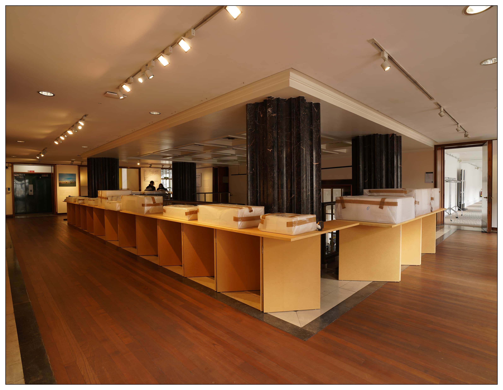

<special>
</special>

## Sensitive Urbanity, Atelier Deshaus in Shanghai

The solo exhibition of Atelier Deshaus, ‘Sensitive Urbanity: Atelier Deshaus in Shanghai’ opened to public on 17th October at the London headquarters of the Royal Institute of British Architects (RIBA). It showcases a series of representative complete works located in Shanghai by Atelier Deshaus within their 20 years of architectural practice. Through the architectural models, images and display panels, this exhibition shows how Deshaus – by responding to changing urban realities and practice contexts – formulates its creative design methodologies and languages.

Atelier Deshaus aims to respond to rapid urban development in China in a sensitive way. Their projects are characterized by discovering inherent potentials and providing unconventional solutions, which are then evolved into a particular manner of design thinking through research. In its own unique way, the practice reflects the shift in Shanghai's urban growth from that of suburban sprawl to city-centre regeneration. Accordingly, its working strategy has turned from expressing abstractness in regard to regional culture to a design language that is far more open to global issues. From being engaged in the renovation of several industrial buildings alongside the Huangpu River in Shanghai during the past eight years, Atelier Deshaus has developed a new modus operandi that focusses upon intricate structural insertions in response to different historical contexts. This results in the integration of new additions along with new programmes into post-industrial relics in order to create a different ensemble of time and space, mixing the tangible with the intangible. Likewise, a subtle synthesis of contemporality and urbanity has also emerged in recent new-build projects of Atelier Deshaus, distinguished both by their rich sense of materiality and a desire to participate fully in city life. Remarkably, the practice’s expanded vision has not led to any compromise in architectural quality, but rather has helped it to reassert the intrinsic value of architecture as a vital part of China’s dramatically changing urban realm.

I participated in the layout and design of the entire exhibition.

 

