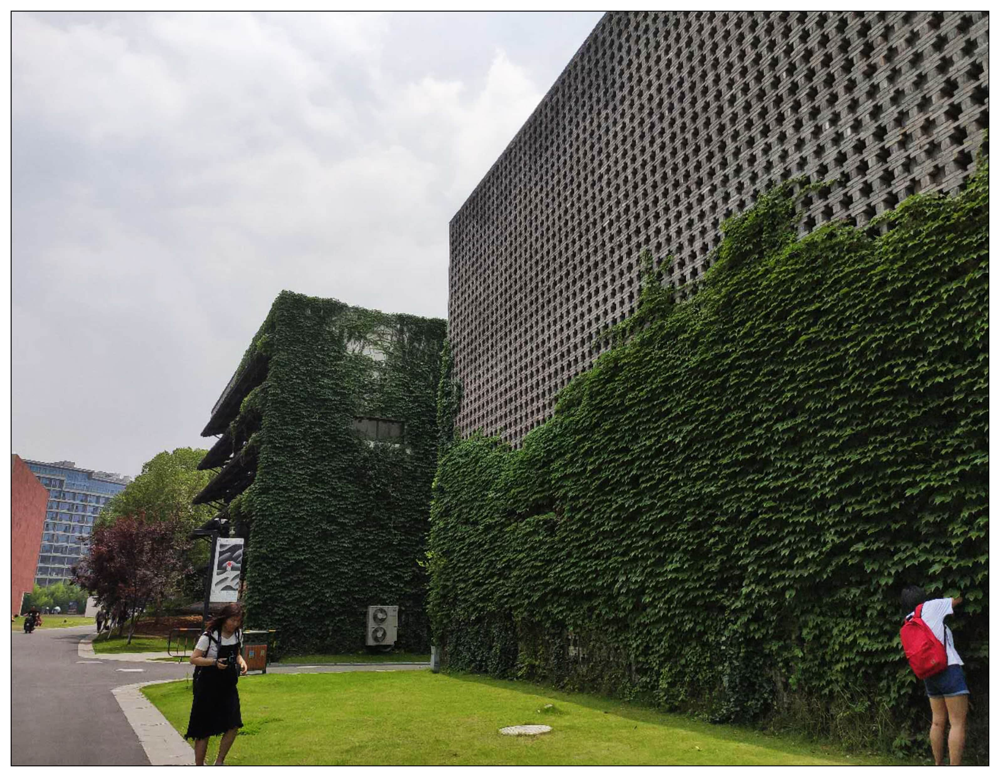
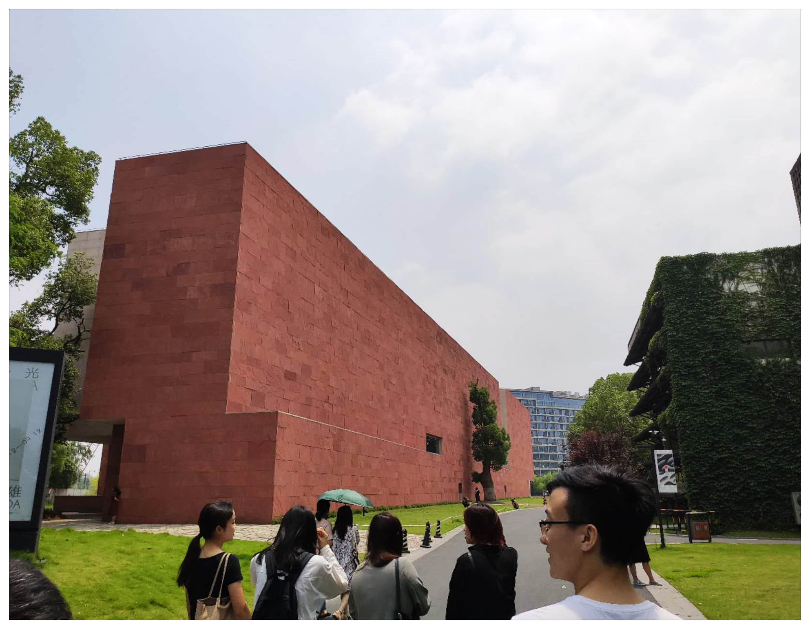
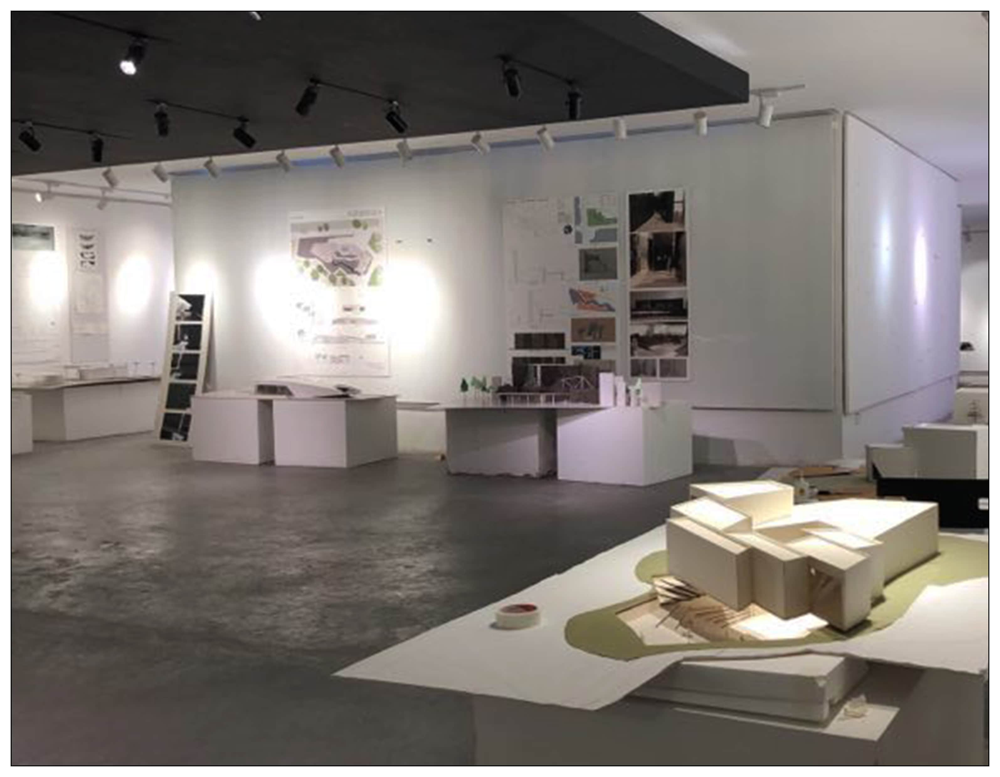

<special>
</special>

## UNNCxCAA Exhibition

The UNNCxCAA Exhibition is a academic activity hold by the architecture faculty of the Univerisity of Nottingham Ningbo and China Academy of Art (lead by Chinese architect Wang Shu) in the summer of 2018. In addition to a series of lectures shared by professors from both sides, the selected students also bring their projects to the other univerisity, and present their process of design and study. The activity is the first time for me to participate in such academic activities.

I join the exhibition as student representative.

 

