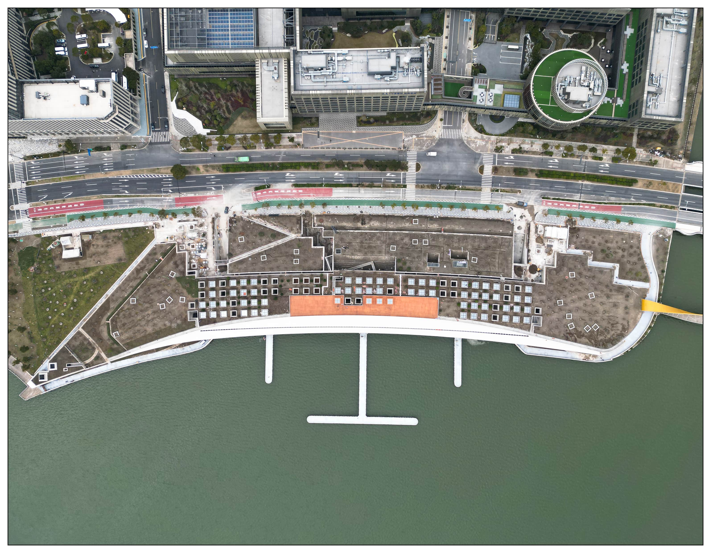
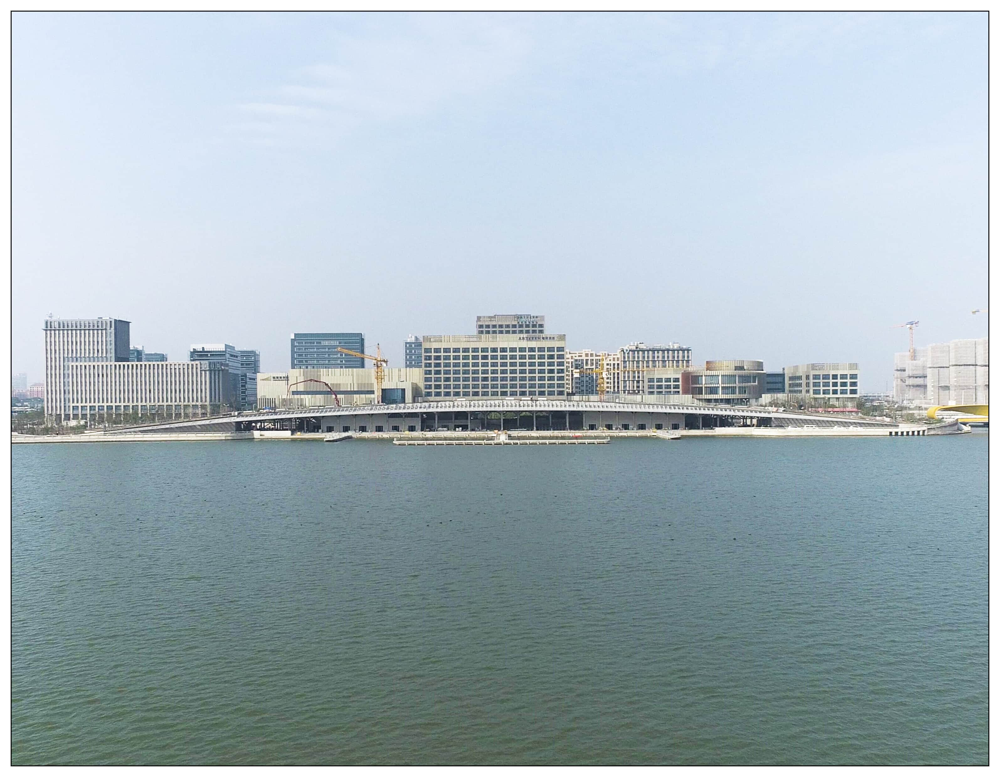
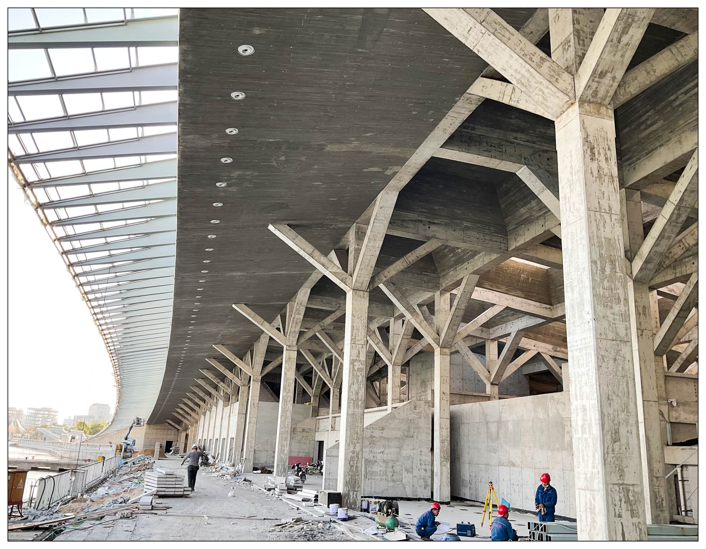
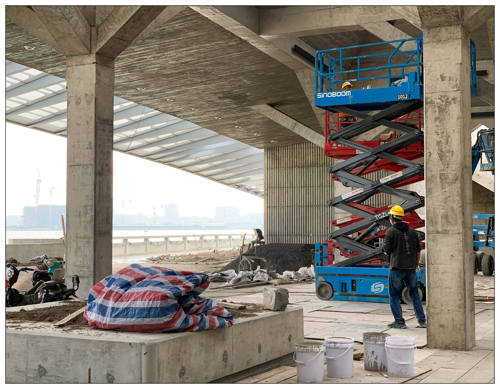
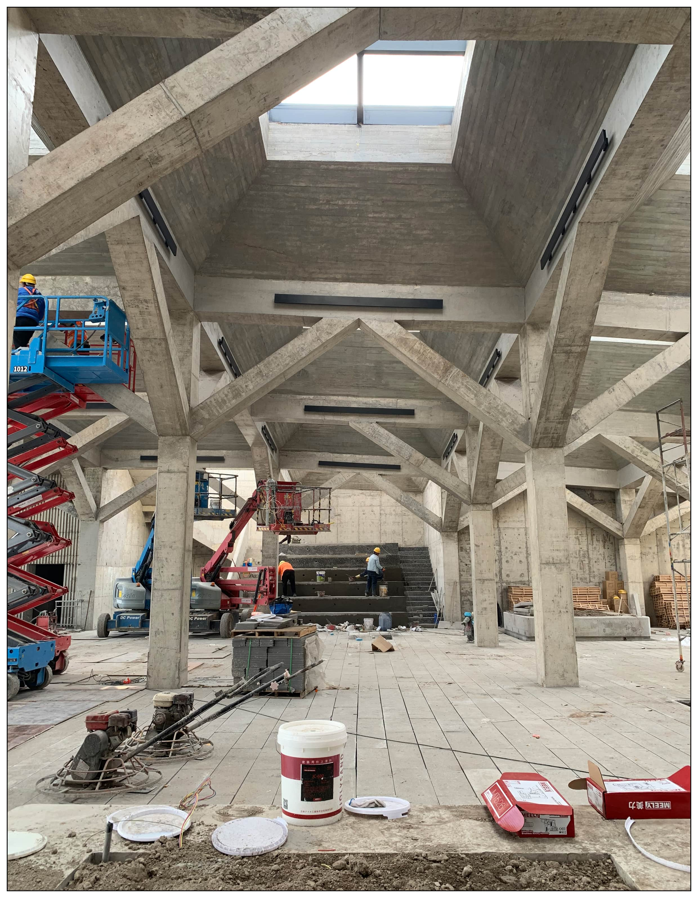
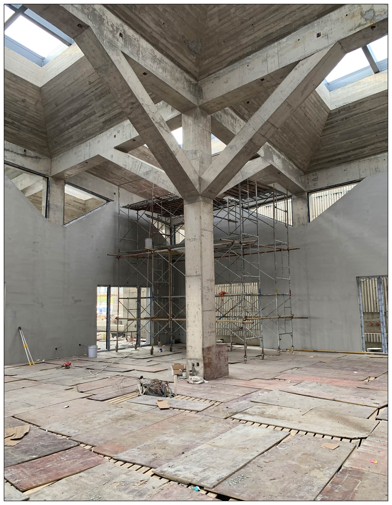
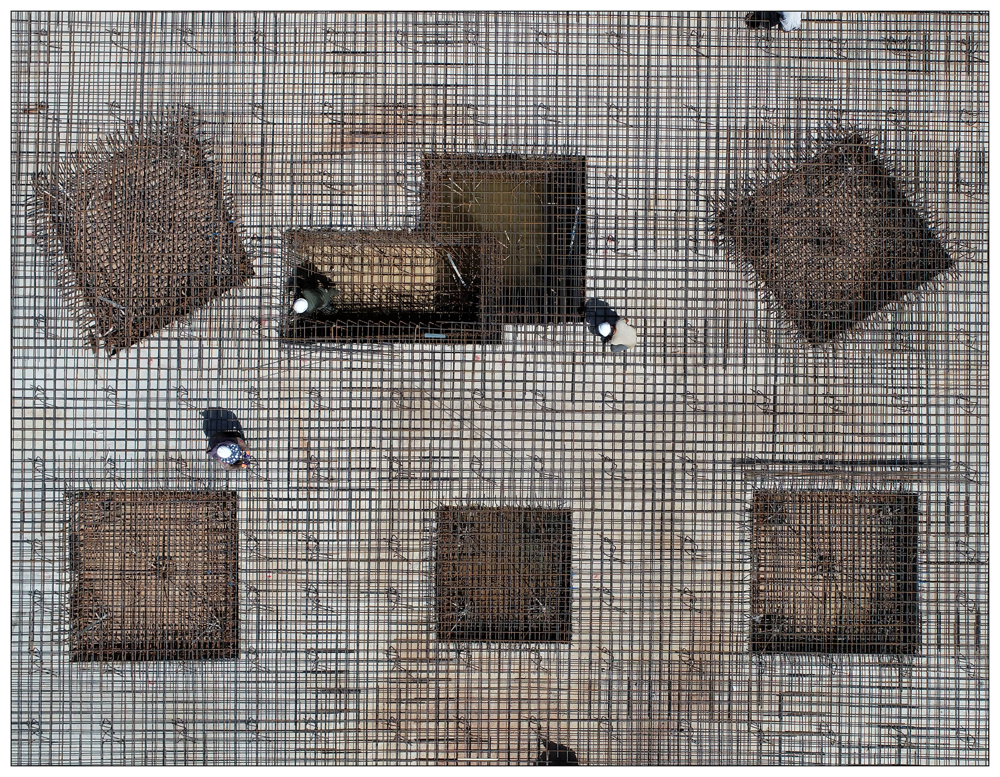
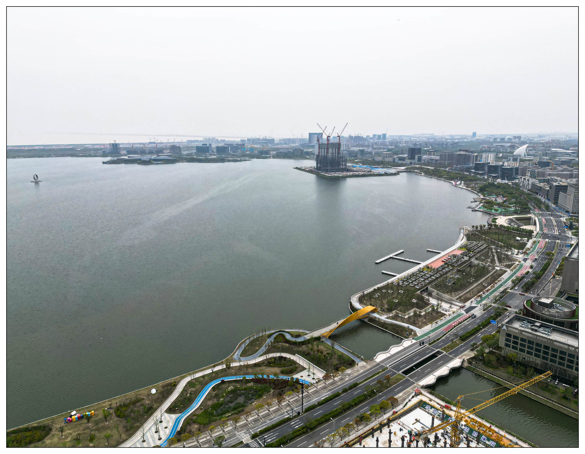

<special>
</special>

## Dishui Lake Pier (Under Construction)

Dishui Lake Pier is the first complete project I participate as an architect in TM Studio (梓耘斋建筑事务所), Shanghai. Located in the Dishui Lake area of Shanghai, the project is a public building commissioned by the Shanghai government with landscape and transportation functions.

As a junior architect, I was deeply involved in design and construction drawing. The construction of the project began in late 2021 and will be completed in 2023.

You could find more about TM Studio at: 

https://www.archdaily.com/office/tm-studio

 

