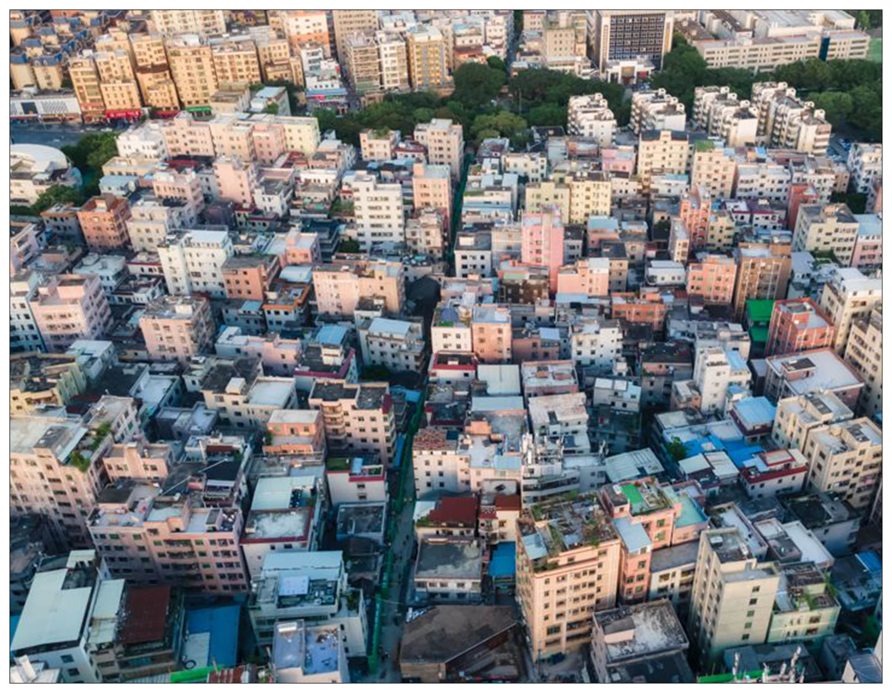
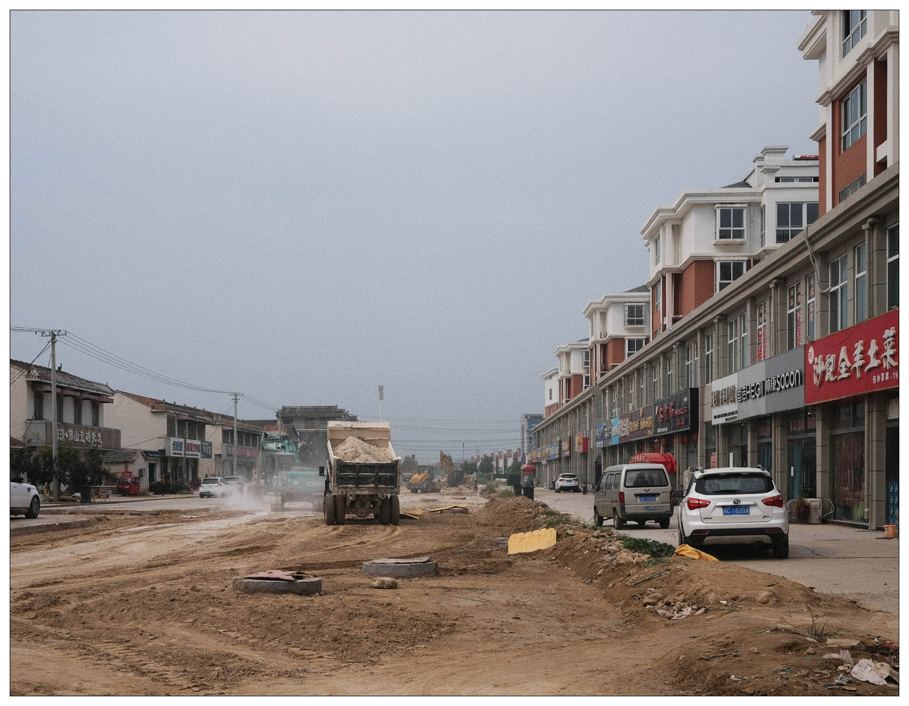

<special>
</special>

## The Space as Urban-Rural Continuum

The Space as Urban-Rural Continuum is an eassy sample I worte in my master study in 2022 at AA School, which is also one of my favorite eassy. 

Read the whole article: 

[The Space as Urban-Rural Continuum](https://github.com/HanwenXU721/HanwenXU.github.io/blob/master/resources/The%20Space%20as%20Urban-Rural%20Continuum.pdf)

 

 FIG.1. "The Village in the City", Guangdong

 FIG.2. "The City in the village", Zhejiang

