<special>
</special>

## AI Render Sample in Practice

In the past year, for the first time, the rise of artificial intelligence technology gives me the direct shock with my own life/career. There is no doubt in everyone's mind that this will change human life and ways of production in the future. But in fact, how to put AI technology into actual production is still a problem that puzzles most people now.

Here, I  show some of my thoughts and sample on the use of AI in architecture study/architectural design. I believe such technology is already mature enough to be an efficient part of architects' workflow to increase efficiency and provide inspiration.

 

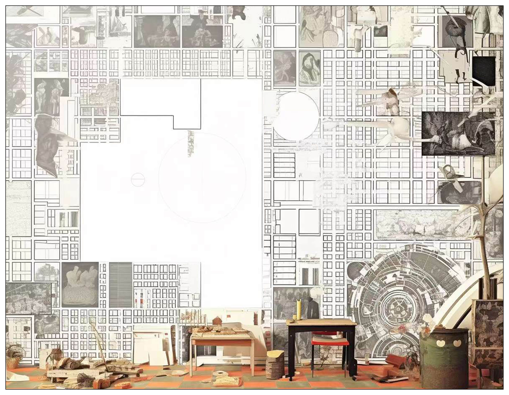
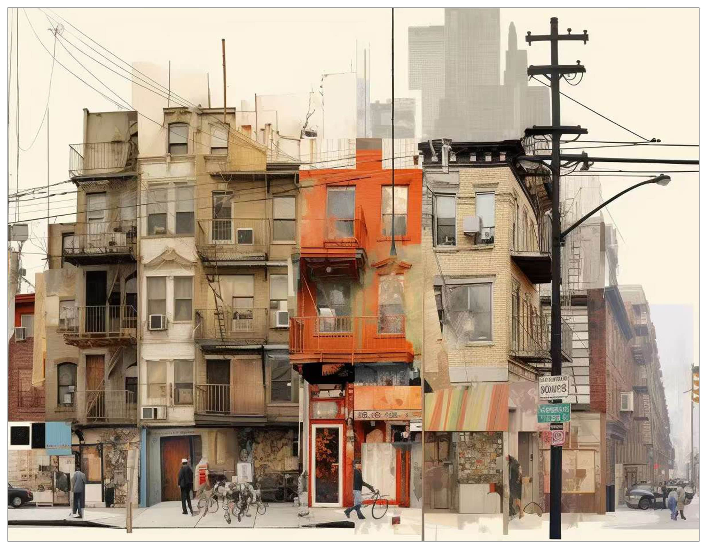
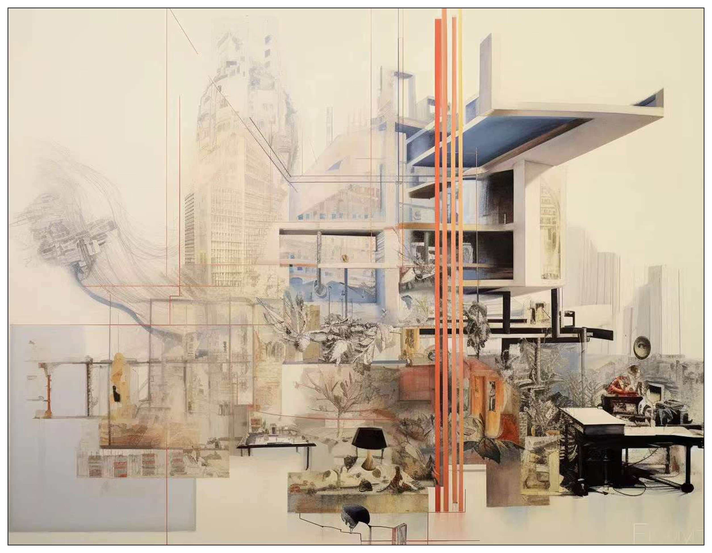
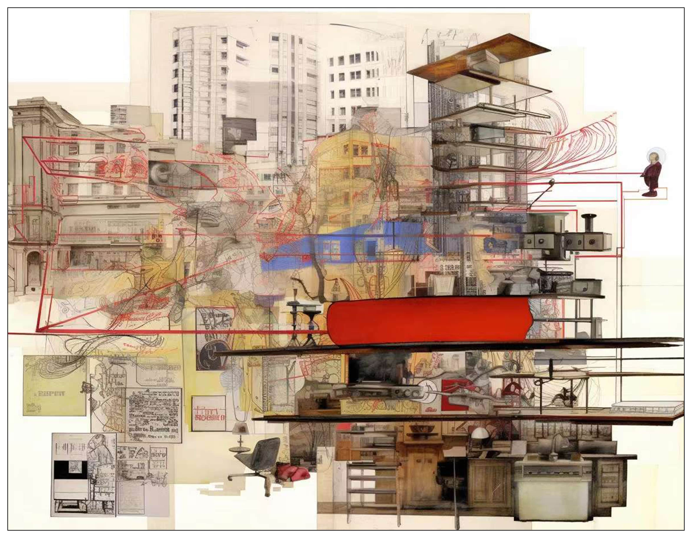
 FIG.1. Architectural Collage of Shanghai, with Midjourney

At the beginning of a research/design project, Midjourney could support amazing opportunity of brainstorming. In this step, the idea in architects' mind is usually hard to describe and indefinable. Midjourney could translate the language of architect/researcher into collage/image/drawing, which actually give us chance to break through the imagination.

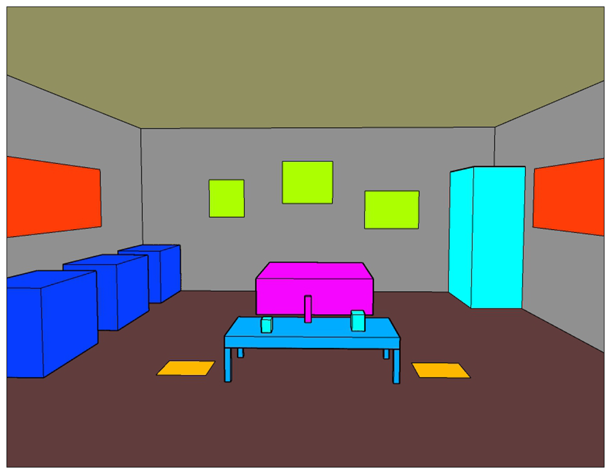
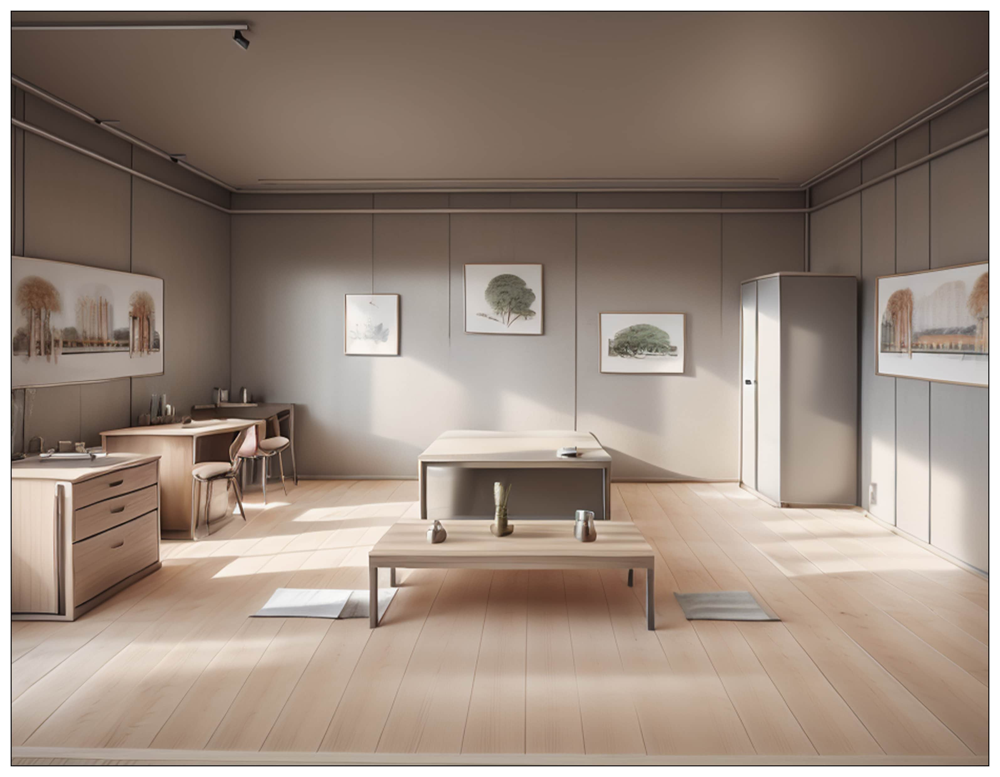
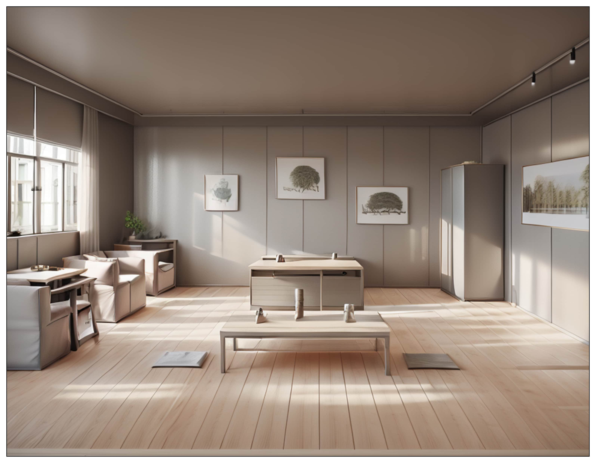
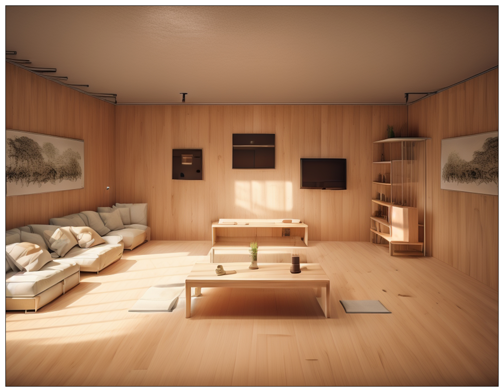
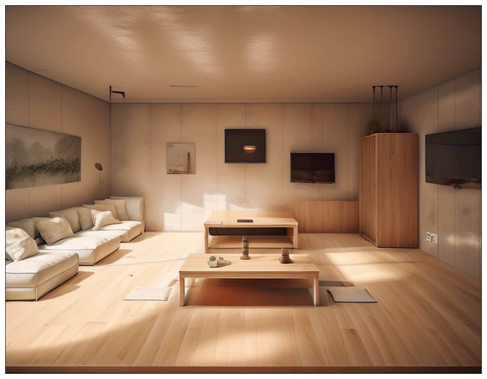
 FIG.2. From Model to Conceptual/Vibe Rendering, with Stable Diffusion

Compared with traditional render tools, Stable Diffusion provides architects with a very efficient way to develop conceptual designs quickly. Here shows one interior example of me from the block models in Sketchup to high-quality renderings, which use very little time for the architect to visualize their design. It is conceivable that this tool could save architects a lot of time and devote it to real design and thinking processes.

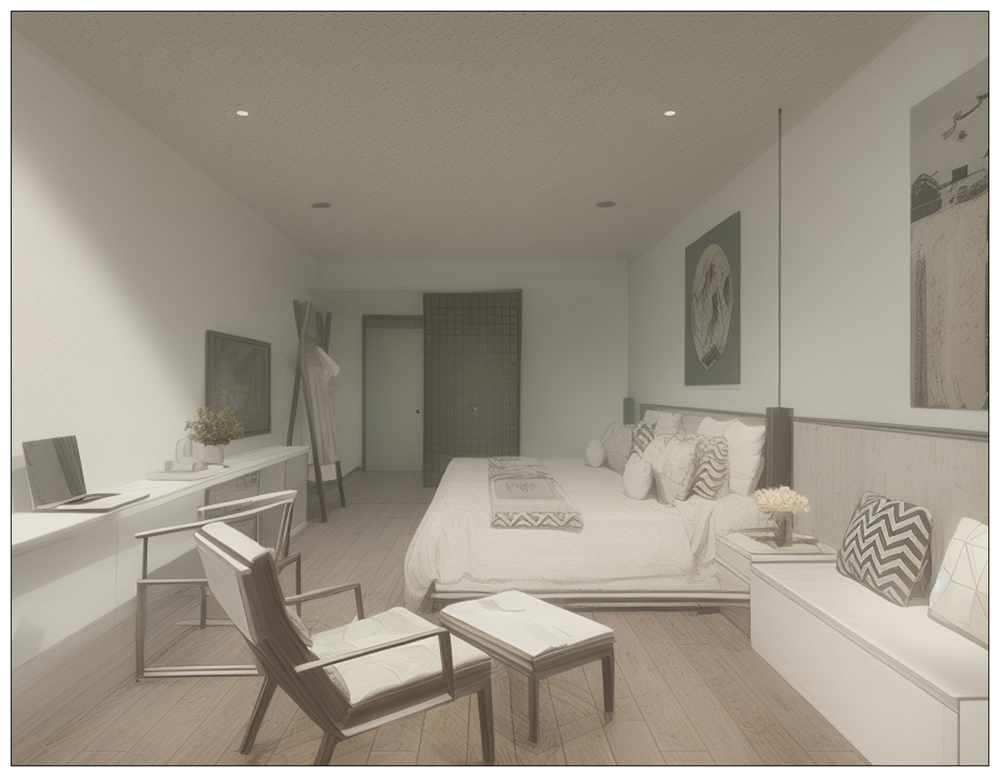
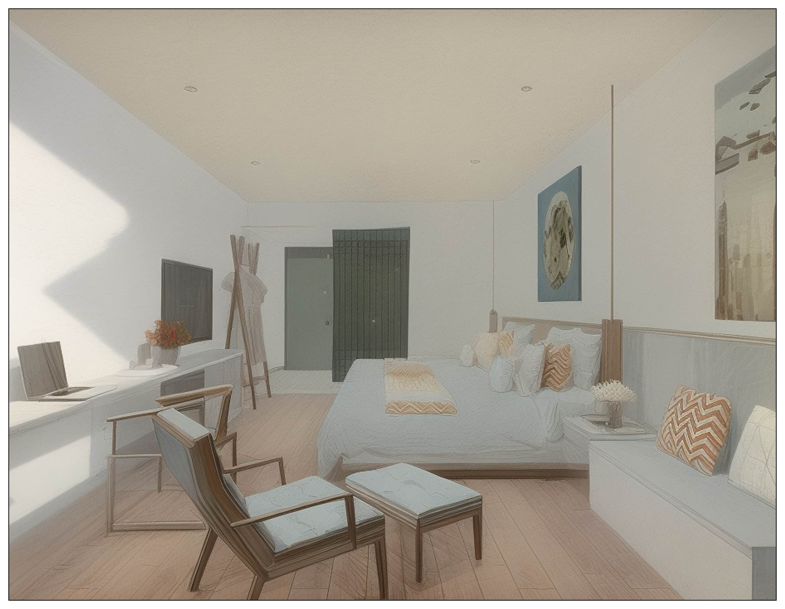
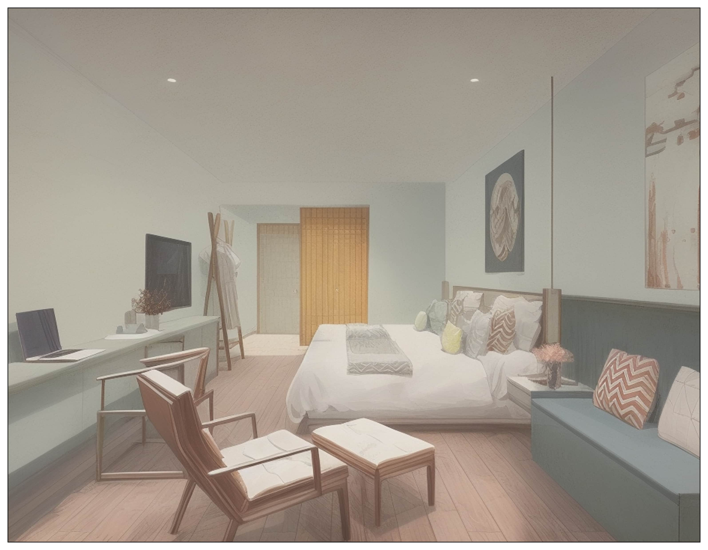
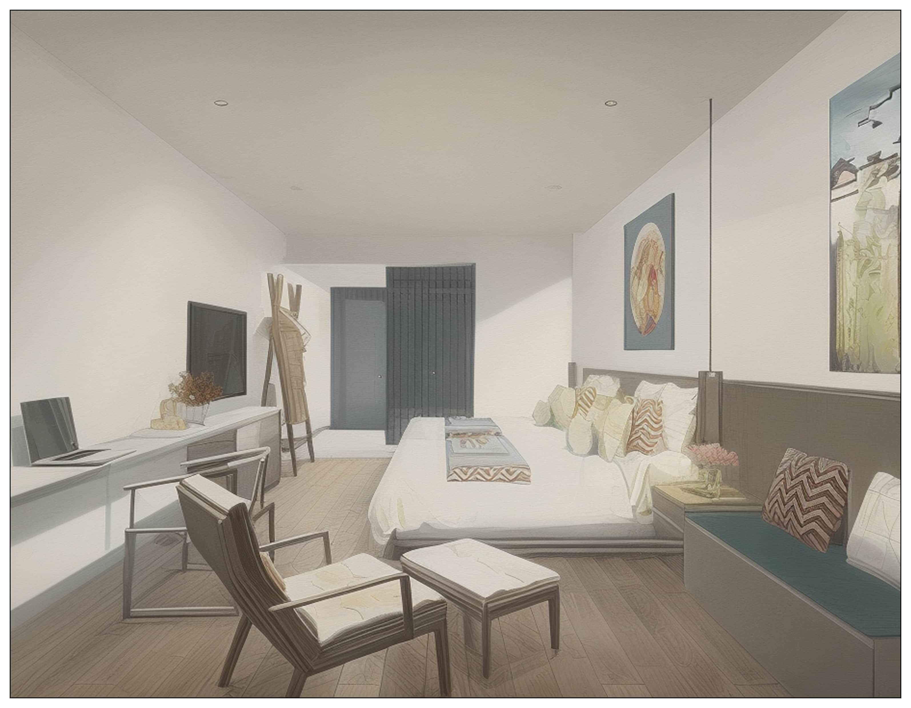
 FIG.3. Infinite Possibilities of AI Rendering, with Stable Diffusion

Due to its basic logic, the rendering by Stable Diffusion has infinite possibilities, which means it could provide architects with thousands of rendering due to different Models and Lora. Here show a series of interior rending made by me of the same space with different vibes.
