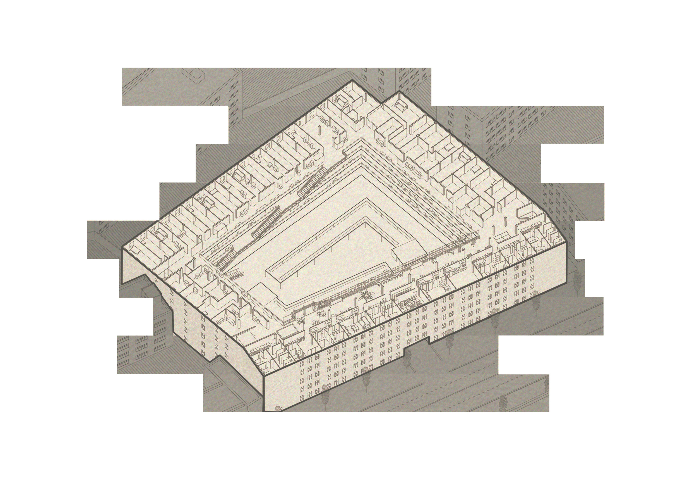

<special>
</special>

## Folding Longchang

The project "Folding Longchang" show work with subtle tragic overtones. Shanghai, the symbol of China's modernization and urbanization, is sucking in labour from all over China as its fuel. Farmers from Anhui, Henan and northern Jiangsu provinces have come to this metropolis and become labourers. However, the strict hukou system and the uneven distribution of public resources make settling in Shanghai an unrealistic goal for them. The most realistic strategy for these workers is to consider Shanghai a factory to work in and then return hometown to start a "real" life after saving enough money.

Under such a realistic logic, this project chooses Longchang Apartment as the object for renovation, which aims to create a new type of collective living for the migrants to resist the pressure of the metropolis..

I analysed the weakness of current urban form in Shangdi district, and decided to generate roads, minify blocks, and import public squares from three aspects. Also at that time, I wanted to draw something different. Line drawing looks pretty good on an urban planning design. 

